# <a href= "https://www.inteli.edu.br/"></a> Instituto de Tecnologia e Liderança 

# OMP

## Maroon 5

## :student: Integrantes: 
- <a href="https://www.linkedin.com/in/israel-carvalho-706133241/">Israel Carvalho</a> 
- <a href="https://www.linkedin.com/in/jos%C3%A9-vitor-marcelino-4165ba24a/">José Vitor Marcelino</a>
- <a href="https://www.linkedin.com/in/lfcovas97/">Luiz Fernando Covas</a>
- <a href="https://www.linkedin.com/in/rafael-techio/">Rafael Mateus Zimmer Techio</a> 
- <a href="">Isabela Rocha</a>

## :teacher: Professores:
### Orientador(a) 
- <a href="https://www.linkedin.com/in/vanunes/">Vanessa Nunes</a>
### Instrutores
- <a href="https://www.linkedin.com/in/jose-romualdo/">Programação - José Romualdo</a>
- <a href="https://www.linkedin.com/in/seulogin/">Matemática e Física - Geraldo Vasconcelos</a>
- <a href="https://www.linkedin.com/in/seulogin/">Negócios - Lisane Valdo</a>
- <a href="https://www.linkedin.com/in/seulogin/">Design - Guilherme Henrique de Oliveira Cestari</a> 
- <a href="https://www.linkedin.com/in/seulogin/">Liderança - Filipe Gonçalves</a>


## Conteúdo
**[1. Visão Geral do Projeto](#1-visão-geral-do-projeto)**

  * [1.1. Parceiro de Negócios](#11-parceiro-de-negócios)
    * [1.1.1. Partes Interessadas](#111-partes-interessadas)
    * [1.1.2. Análise da Indústria](#112-análise-da-indústria)
  * [1.2. Problema](#12-problema)
    * [1.2.1. Análise do Problema](#121-análise-do-problema)
    * [1.2.2 Análise do cenário: Matriz SWOT](#122-análise-do-cenário-matriz-swot)
  * [1.3. Descritivo da Solução](#13-descritivo-da-solução)
    * [1.3.1. Objetivos](#131-objetivos)
      * [1.3.1.1 Objetivos Gerais](#1311-objetivos-gerais)
      * [1.3.1.2 Objetivos Específicos](#1311-objetivos-gerais) 
    * [1.3.2. Proposta de Valor: Value Proposition Canvas](#132-proposta-de-valor-value-proposition-canvas)
    * [1.3.3. Matriz de Risco](#133-matriz-de-risco)
  * [1.4. Proposta Tecnológica e Benefícios](#14-proposta-tecnológica-e-benefícios)
    * [1.4.1. Tipo de arquitetura de nuvem escolhida](#141-tipo-de-arquitetura-de-nuvem-escolhida)
    * [1.4.2. Arquitetura de nuvem escolhida](#142-arquitetura-de-nuvem-escolhida)
    * [1.4.3. Benefícios trazidos pela arquitetura de nuvem proposta](#143-benefícios-trazidos-pela-arquitetura-de-nuvem-proposta)

**[2. Entendimento da Experiência do Usuário](#2-entendimento-da-experiência-do-usuário)**

  * [2.1. Perfis de Usuários](#21-perfis-de-usuários)
    * [2.1.1. Personas](#211-personas)
  * [2.2. Mapa de Jornada do Usuário](#22-mapa-de-jornada-do-usuário)
  * [2.3. Wireframes](#23-wireframes)

**[3. Requisitos](#3-requisitos)**

  * [3.1. Requisitos Funcionais](#31-requisitos-funcionais)
    * [3.1.1. Casos de Uso](#311-casos-de-uso)
    * [3.1.2. User Stories](#312-user-stories)
  * [3.2. Requisitos não Funcionais](#32-requisitos-não-funcionais)

**[4. Arquitetura do Sistema](#4-arquitetura-do-sistema)**

  * [4.1. Diagrama de Arquitetura](#41-diagrama-de-arquitetura)
  * [4.2. Diagrama de Implantação](#42-diagrama-de-implantação)
    * [4.2.1. Procedimentos de implantação da solução](#421-componentes-que-compões-a-solução)
    * [4.2.2. Procedimentos de implantação da solução](#422-procedimentos-de-implantação-da-solução)
  * [4.3. Diagrama de Sequência](#43-diagrama-de-sequência)

**[5. Projeto e Implementação UX e UI](#5-projeto-e-implementação-ux-e-ui)**

  **[5.1. Frontend](#51-frontend)**
  * **[5.1.1 Design System](#511-design-system)**

**[6. Projeto de Banco de Dados](#6-projeto-de-banco-de-dados)**

  **[6.1. Modelo Conceitual](#61-modelo-conceitual)**
  **[6.2. Modelo Lógico](#62-modelo-lógico)**

**[7. Testes de Software](#7-testes-de-software)**
    
  * **[7.1. Teste de Integração](#7.1-teste-de-integracao)**

**[8. Documentação da API](#8-documentação-da-api)**

**[Referências](#referências)**

**[Apêndice](#apêndice)**

# 1. Visão Geral do Projeto

## 1.1 Parceiro de Negócios
O Instituto de Tecnologia e Liderança - Inteli é uma faculdade particular brasileira sem fins lucrativos que tem o objetivo de ser a melhor faculdade de computação da américa latina. Para tal, atua através de ensino por projetos, uma metodologia baseada nos casos de estudo de Harvard, infraestrutura de ponta, docentes engajados e o pensamento de aluno no centro. Assim, o principal objetivo do Inteli é a formação de novos líderes, com enfoque em tecnologia, e para tal os cursos oferecidos são: Engenharia de Software, Ciências da Computação, Engenharia de Computação e Sistemas de Informação. A carga horária dos cursos é divida em 5 matérias: matemática, programação, negócios, centro de desenvolvimento de lideranças e orientação. Durante todo o período letivo, os estudantes desenvolverão algum projeto para o mercado, tendo contato com empresas, ongs e organizações governamentais. Nesse contexto, com o objetivo de administrar as relações com empresas, desenvolver a estrutura dos projetos e retornar os protótipos, há um departamento interno denominado escritório de projetos, o qual é o principal stakeholder deste projeto. Sendo assim, com todos esses pilares da instituição e a sua proximidade do mercado, o Inteli oferece um amplo programa de bolsas financiado por doações, oferecendo moradia, alimentação, curso de inglês e notebook para os alunos que necessitarem.

### 1.1.1 Partes Interessadas 
O principal stakeholder da solução é o escritório de projetos do Inteli, que será beneficiado no dia-a-dia com a redução de processos manuais e a análise mais rápida das iniciativas, podendo assim escalar a quantidade de projetos simultâneos e consequentemente a quantidade de turmas. Dessa forma, outro stakeholder é o próprio Inteli, que será beneficiado por uma melhor qualidade da estruturação de novos projetos e consequentemente um maior interesse pelos futuros alunos e mercado. Como projetos mais bem estruturados e em maior qualidade e quantidade serão viáveis, empresas que desejam se tornar parceiras do inteli são influenciadas pela solução, pois receberão protótipos de melhor qualidade como resultado da solução, sendo assim um stakeholder secundário.

### 1.1.2 Análise da Indústria
No contexto em que o Inteli está inserido, foram encontrados dois grandes concorrentes, apesar de apenas o Inteli oferecer ao mesmo tempo: ensino por projetos, proximidade com o mercado e amplo programa de bolsas em uma instituição de ensino com enfoque em graduação de tecnologia. Sendo assim, os principais concorrentes da faculdade são:

**Insper**
Apesar de oferecer apenas ciências da computação como curso de tecnologia, o Insper é um concorrente por também estar próximo ao mercado, ser uma instituição de ensino grande sem fins lucrativas, discursar a missão de formar líderes e possuir uma ótima infraestrutura. Apesar de não disponibilizar um programa de bolsas além da mensalidade integral, ao juntar os pontos apresentados pode-se definir uma persona-aluno muito próxima ao aluno do Inteli, o que é uma ameaça de mercado. 

**FIAP**
A Faculdade de Informática e Administração Paulista - FIAP é uma das principais concorrentes do Inteli atualmente, principalmente após a parceria com uma das maiores provedoras de cursos de tech, a Alura. Hoje a FIAP conta com parceria de diversas empresas onde juntas, fazem projetos denominados challenges e há um grande programa de incentivo a entrada no mercado de trabalho aos alunos. Seus cursos de tecnologia são variados e possuem opções de tecnólogo e graduação. Apesar de uma grande presença da marca apontando para o público jovem, o programa de bolsas apenas conta com porcentagens na matrícula mensal.

#### 1.1.2.1 5 Forças de Porter
As 5 forças de Porter são uma forma de identificar o posicionamento de mercado de uma empresa em relação ao que está além dela, o mercado. A seguir, um canvas com a análise do Inteli:


Figura 1: Forças de Porter

**Poder dos Fornecedores**

Por ser uma faculdade financiada por grandes players da iniciativa privada, o Inteli tem grandes fundos para buscar os melhores profissionais para suas equipes de ensino e administração. Quanto às empresas que fornecem iniciativas para criar projetos, há um grande mercado e o Inteli vem construindo uma ótima reputação com essas empresas. Portanto, o poder de barganha dos fornecedores é baixo.

**Poder dos Compradores**

Os principais compradores do Inteli são os próprios alunos, e apesar da faculdade ainda estar no processo de construção da consolidação da marca, uma etapa muito perigosa, há grande procura por cursos de tecnologia por todo o Brasil. Sendo assim, graças ao programa de bolsas, a influência da instituição pode chegar a grande parte da demanda brasileira. Dessa forma, o poder de barganha dos compradores é médio.

**Ameaça de Substitutos**

O principal substituto encontrado são os cursos básicos de tecnologia em plataformas online como Alura e Udemy. Apesar da ampla procura por esse tipo de conteúdo, o mercado está começando a buscar certificações com mais peso para garantir o conhecimento dos profissionais que irá contratar. Nesse sentido, a ameaça de substitutos é média.

**Ameaça de Novos Entrantes**

Por estar em processo de consolidação da marca, novos entrantes são especialmente perigosos para o Inteli, ainda que haja um grande networking com empresas grandes como o BTG. Dessa forma, o risco é médio.

**Rivalidade de Concorrência**

O Inteli possui alguns grandes concorrentes que atuam com o mesmo segmento de mercado, como é o caso da FIAP e Insper. Ainda sim, o programa de bolsas do inteli faz com que sua área de influência seja o Brasil todo e não apenas a região polo de São Paulo, atingindo pessoas que essas faculdades não atingiram com cursos presenciais. Sendo assim, a influência é média.


## 1.2 Problema

A oportunidade de negócio reside na forma como é manejada toda a gestão de projetos pela instituição de ensino Inteli. Nesse contexto, o problema a ser resolvido está na não sistematização dos processos relacionados à criação e manutenção dos projetos, hoje em excel.

### 1.2.1 Análise do Problema

A problemática enfrentada pelo Escritório de Projetos do Inteli reside na atual forma de criação e gerenciamento dos projetos de módulos para cada turma da instituição. O processo atual, baseado em várias planilhas de Excel, pode acarretar inconsistências nos dados, não possui agilidade suficiente e demanda grande esforço administrativo. Além disso, questões secundárias aparecem na gestão dos protótipos desenvolvidos pelos alunos, pré-seleção das iniciativas mais pertinentes para os módulos, match entre projetos e turmas, gestão dos contatos, prazos de documentação e governança dos dados relacionados a tais práticas.

### 1.2.2 Análise do cenário: Matriz SWOT

Uma matriz SWOT é uma ferramenta de análise que ajuda a avaliar a posição estratégica de uma organização, projeto ou ideia. O termo "SWOT" é um acrônimo das palavras em inglês Strengths (Forças), Weaknesses (Fraquezas), Opportunities (Oportunidades) e Threats (Ameaças). Utilizar matriz SWOT ajuda poder identificar sua situação atual, compreender melhor seu ambiente interno e externo, desenvolver estratégias para maximizar suas forças, minimizar suas fraquezas, aproveitar oportunidades e mitigar ameaças.

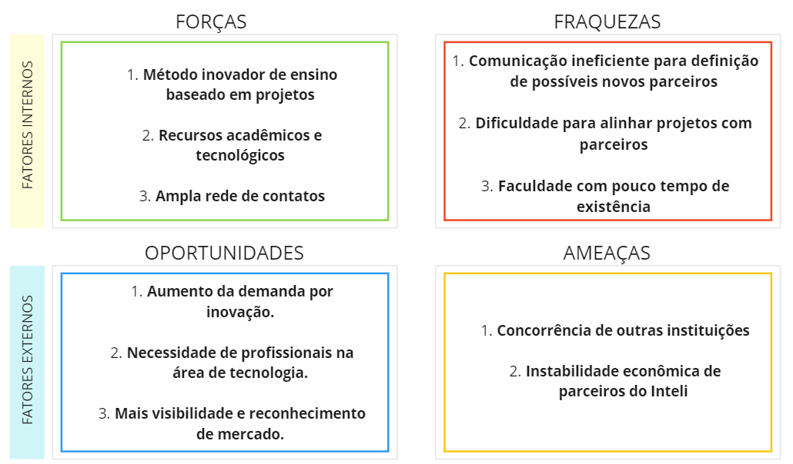

figura 2: Matriz de análise SWOT


---

#### Forças

1. __Método inovador de ensino baseado em projetos__
  - Ensino baseado em projetos, algo inovador no Brasil que consequentemente acaba atraindo parceiros interessados em investir na educação e em soluções criativas.

2. __Recursos acadêmicos e tecnológicos__
  - A instituição possui recursos acadêmicos, como professores especializados e instrumentos tecnológicos de ponta

3. __Ampla rede de contatos__
  - A faculdade possui muitas parcerias com diversas empresas, instituições de ensino e ONGs. A angariação de contatos facilita a criação de novos projetos.

---

#### Fraquezas

1. __Comunicação ineficiente__ 
  - Muitas vezes sobram muitas propostas de projeto, nas quais o escritório de projetos não consegue alocar e faz com que a empresa fique em stand-by. Essa espera pode ser crucial já que há chance de, futuramente não ser mais possível seguir em frente com a iniciativa proposta pelo parceiro.

2. __Dificuldade para alinhar projetos com parceiros__
  - A explicação sobre o funcionamento do sistema de projetos do Inteli muitas vezes confundem possíveis parceiros fazendo com que eles tenham altas expectativas em relação aos projetos ou entendam que de maneira errônea a proposta do ensino baseado em projetos.

3. __Faculdade com pouco tempo de existência__
  - O Inteli, fundado em 2019, é uma instituição recente que está em processo de estabelecer sua reputação e nome no mercado. A faculdade não possui nem turmas formadas.
---

#### Oportunidades

 1. __Aumento da demanda por inovação__ 
  - Com o cenário tecnológico em constante mudança, empresas e organizações estão buscando parcerias com instituições de ensino para inovar e se manterem competitivas.

2. __Necessidade de profissionais na área de tecnologia.__
  - Há uma crescente demanda por profissionais na área de tecnologia, portanto, muitas empresas podem olhar pro Inteli em busca de profissionais capacitados e adaptados a trabalharem em projetos reais.

3. __Mais visibilidade e reconhecimento no mercado__
  - Através de parcerias, a faculdade pode ampliar sua rede de contatos e aumentar sua visibilidade no mercado. Além de tudo, as soluções entregues pelos alunos podem gerar valor e reconhecimento para a faculdade.

---

#### Ameaças

1. __Concorrência de outras instituições__
  - Outras faculdades de tecnologia também podem buscar parcerias com empresas e organizações, aumentando a concorrência por projetos conjuntos. Por exemplo: FIAP, Insper e etc.

2. __Instabilidade econômica de parceiros do Inteli__
  - Variabilidades na economia podem impactar a disponibilidade de recursos para projetos em parceria.


---

## 1.3 Descritivo da Solução

Como resultado, a solução proposta requer uma abordagem integrada para consolidar, sistematizar e registrar as informações que permeiam toda a administração das iniciativas empresariais, execução de projetos de módulos e apresentação de protótipos elaborados pelos estudantes. Este projeto, em virtude de sua aptidão para organizar e harmonizar os processos multifacetados, pretende aumentar a eficiência, a celeridade e a abrangência dos processos vigentes.

### 1.3.1 Objetivos

#### 1.3.1.1 Objetivos Gerais

Sob a perspectiva da problemática analisada, em primeira instância, este projeto deve sistematizar os processos de criação e gerenciamento das iniciativas empresariais, projetos de módulos e protótipos a fim de beneficiar a instituição através de agilidade na execução e proporcionar uma melhor visualização gráfica dos dados pertinentes.

#### 1.3.1.2 Objetivos Específicos

Para possibilitar o êxito da problemática principal, a solução será uma aplicação web conectada a um banco de dados que viabilizará operações de criação, resgate, atualização e exclusão de entidades como usuários, empresas, turmas, módulos, iniciativas empresariais, projetos de módulo e protótipos.
### 1.3.2 Proposta de Valor: Value Proposition Canvas

Elaboramos um VPC (Value Proposition Canvas) com o objetivo de identificar a maneira mais eficaz de proporcionar valor aos nossos clientes. Este Canvas atua como um guia visual, assegurando que os produtos e serviços que oferecemos estejam alinhados às autênticas necessidades dos nossos clientes.


Figura 3: Canva proposta de valor


### 1.3.3  Matriz de Risco
Criamos duas matriz de riscos para organizar e classificar os diversos riscos que nosso projeto e nosso grupo pode enfrentar ao longo das sprints. Essa matriz nos permite avaliar e priorizar riscos com base em sua probabilidade e impacto, distinguindo quais demandam ação imediata e quais podem ser abordados posteriormente. Isso nos auxilia na tomada de decisões estratégicas, otimizando a alocação de nossos recursos.


Figura 4: Matriz de riscos do grupo

A Matriz de Riscos é utilizada para pontuar os riscos de um projeto, de acordo com a probabilidade de ocorrência e o impacto que cada risco pode causar. A partir disso, é possível priorizar os riscos e definir ações para mitigá-los. Em contraponto, também apresentamos oportunidades que podem surgir ao decorrer do projeto, seguindo a mesma lógica. A matriz de riscos do projeto está apresentada abaixo:

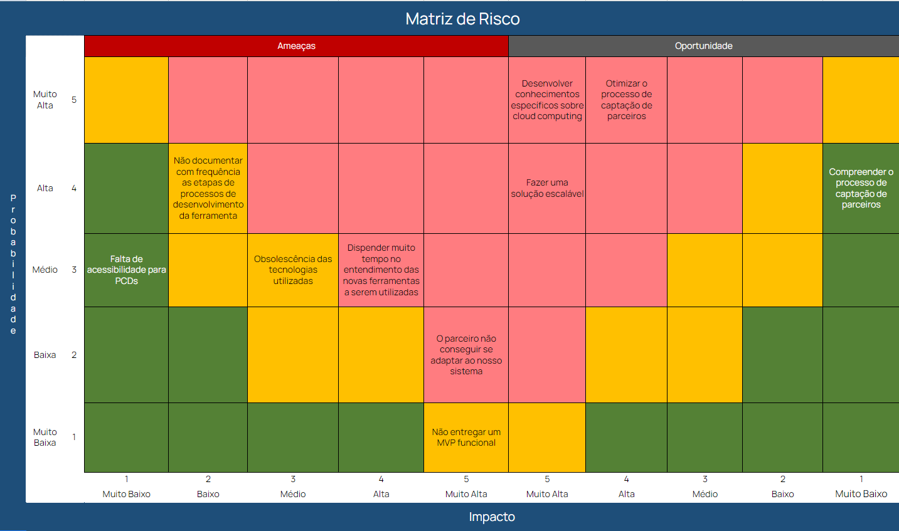

#### Riscos

1. __Falta de acessibilidade para PCDs__
  Suporte a pessoas com daltonismo, visão reduzida, ou até mesmo deficientes visuais são importantes porém, dado o tempo, pode ser que elas não sejam implementadas. 

2. __Não documentar com frequência as etapas...__
  Pelo decorrer do projeto, pode ser que demoremos mais para documentar algumas etapas, o que pode gerar um acúmulo de tarefas e atrasar o projeto.
  Para combater isso, devemos nos manter atentos aos prazos.

3. __Obsolência das tecnologias utilizadas__
  Pode ser que em alguns anos, algumas tecnologias se tornem obsoletas, o que pode acabar por diminuir a velocidade e segurança do sistema. Para isso, estamos buscando utilizar as versões mais recentes dos softwares mais utilizados no mercado.

4. __Não entregar um MVP funcional__
  Por diversos fatores, como dificuldades acadêmicas ou técnicas, pode ser que o projeto não seja entregue com todas as funcionalidades planejadas. Entretanto, acreditamos que isso seja bem improvável, visto que até o momento já entregamos vários MVPs funcionais e estamos estudando bastante e nos planejando para que isso não ocorra.

5. __Dispender muito tempo no entendimento das ferramentas...__
  Por estarmos utilizando diversas ferramentas novas, pode ser que demoremos mais tempo para entender como elas funcionam e como podemos utilizá-las da melhor forma. Para isso, estamos buscando estudar bastante e nos planejando para que isso não ocorra.

6. __O parceiro não conseguir se adaptar ao nosso sistema__
  Por ser uma mudança drástica na forma como o parceiro gerencia seus projetos, pode ser que ele não consiga se adaptar ao nosso sistema. Para isso, estamos buscando fazer perguntar pertinentes para o parceiro, a fim de entender suas necessidades. Além disso, estamos buscando fazer um sistema intuitivo e de fácil utilização.

#### Oportunidades
1. __Compreender o processo de captação de parceiros__
  Como estudantes podemos descobrir mais a fundo como é feito esse processo e assim levarmos esse conhecimento para o mercado de trabalho.

2. __Otimizar o processo de captação de parceitos__
  Com essa aplicação, almejamos otimizar esse processo, que atualmente é feito de maneira muito manual.

3. __Fazer uma solução escalánvel__
  Como estamos utilizando tecnologias de ponta, como cloud computing e react, e estamos seguindo boas práticas de desenvolvimento, acreditamos que essa solução seja escalável e possa ser utilizada em grande demanda ou até mesmo por outras instituições.

4. __Desenvolver conhecimentos específicos sobre cloud computing__
  Como foco do módulo, certamente iremos aprender bastante sobre cloud computing, o que pode ser um diferencial no mercado de trabalho.

## 1.4 Proposta Tecnológica e Benefícios

O projeto deverá ter seu deploy baseado em cloud (nuvem). Os benefícios dessa características envolvem a facilidade da configuração e manutenção de infrasestrutura e a segurança e disponibilidade que uma das maiores provedoras desse mercado pode oferecer - a AWS.

### 1.4.1 Tipo de arquitetura de nuvem escolhida

A aplicação web deverá ser deployada em cloud na AWS através da arquitetura a seguir, escolhida por sua abrangência e simplicidade:


Figura 5: Diagrama de arquitetura cloud

### 1.4.2 Arquitetura de nuvem escolhida

Todos os serviços utilizados estarão cobertos pela VPC do projeto que irá conter as regras de firewall visando proteger a estrutura de acessos não autorizados. A API backend ficará em uma instância EC2 assim como o frontend, enquanto o banco de dados estará em um serviço RDS e os arquivos em um bucket S3. Essa arquitetura foi escolhida pois além de simples, todos os objetivos do projeto podem ser concluídos.

### 1.4.3 Benefícios trazidos pela arquitetura de nuvem proposta

A arquitetura de cloud escolhida trás escalabilidade ao separar a instância EC2 que guarda o backend do frontend, podendo assim dividir a quantidade de requests que cada instância recebe e precisa lidar. Essa escolha também interfere diretamente na disponibilidade do sistema, que usa de forma inteligente os serviços e segurança que a cloud da AWS oferece.

# 2. Entendimento da Experiência do Usuário

Inclua nesta seção os perfis de usuário e respectivas personas, e o mapa de jornada de usuário.

## 2.1. Perfis de Usuários 

### 2.1.1 Personas

Para entender profundamente as necessidades de nossos parceiros, criamos duas personas distintas. Isso nos ajudará a identificar os diferentes tipos de usuários que acessarão nossa plataforma. Dessa forma, podemos destacar os principais desafios a serem abordados e, assim, entregar a solução mais adequada através de nossa plataforma.


### Persona 1 - Diretora Escritório de projetos

Figura 6: Detalhes sobre a persona 1

### Persona 2 - Líder de comunicações Empresa Boliboli

Figura 7: Detalhes sobre a persona 2

## 2.2 Mapa de Jornada do Usuário
Jornadas do Usuário são um tipo de gráfico que mostra como uma persona irá reagir durante as diferentes etapas de interação com um produto. Sendo assim, foram desenvolvidas duas Jornadas do Usuário para ambas as personas criadas:

**Jornada - Giulia**

Como parte da equipe do Inteli, Giulia deve gerenciar as informações que permeiam os processos relacionados aos projetos. Sendo assim, a interação que imagina-se que Giulia tenha com a solução é:


Figura 8: Jornada do Usuário 1

---

**Jornada - Rodolfo**

Rodolfo é o representante de uma empresa que gostaria de fazer projeto com o inteli. Dessa forma, também terá acesso a parte do sistema e assim, a forma como irá interagir é:


Figura 9: Jornada do Usuário 2


## 2.3 Wireframes
Para uma compreensão mais clara de como as telas do nosso software devem ser estruturadas, facilitando assim a construção da nossa arquitetura - especialmente considerando a modelagem do nosso banco de dados - elaboramos um diagrama. Este nos ajuda a entender as telas necessárias e suas respectivas conexões. Abaixo, apresentamos o modelo que utilizamos para a elaboração do nosso wireframe.


Figura 10: Diagrama de telas (wireframe)

Para proporcionar uma visão mais clara do funcionamento da nossa ferramenta, apresentamos a seguir imagens das telas do nosso software com uma baixa fidelidade, acompanhadas de uma descrição concisa de suas funcionalidades:

### Tela de cadastro

Inicialmente, na tela de cadastro, planejamos solicitar apenas um e-mail e uma senha, visando simplificar e agilizar o primeiro contato com o parceiro e a promoção da plataforma assim como mosta a figura 1

Figura 11: Tela de cadastro (Parceiro e Inteli)


### Tela de login
Uma vez realizado o cadastro, o usuário poderá acessar a plataforma pela tela de login, utilizando as credenciais definidas anteriormente (durante o cadastro), conforme ilustrado na figura abaixo:

Figura 12: Tela de login da plataforma One More Project


### Tela inicial
Após efetuar o login, o usuário será direcionado à tela inicial da plataforma. Nesta, ele encontrará um dashboard com gráficos apresentando as informações mais pertinentes para a gestão da plataforma. Entre elas estão: quantidade de projetos alocados por curso, quantidade de projetos alocados por módulo, categorização de empresas e as turmas mais relevantes com módulos sem projetos, entre outros indicadores. Adicionalmente, o usuário terá acesso a uma barra lateral (sidebar) que o direcionará às demais funcionalidades da plataforma em menos de três cliques. Este design visa facilitar a navegação e otimizar o tempo gasto na gestão dos projetos.


Figura 13: Tela incial da plataforma One More Project


### Sidebar
Uma vez logado em nossa plataforma, o usuário pode acessar facilmente as funcionalidades simplesmente clicando no nome da feature que deseja analisar. As opções disponíveis incluem: Iniciativas, Projetos, Cursos, Parceiros, Turmas, Módulos e Protótipos.


Figura 14: Sidebar com as features da plataforma One More Project


### Tela com lista de iniciativas
Ao optar por visualizar 'Iniciativas', o usuário será direcionado a uma tela que exibe uma lista de todas as iniciativas cadastradas até o momento, destacando as informações mais relevantes de cada uma. Além disso, o usuário tem a liberdade de criar, editar, excluir ou visualizar uma iniciativa em detalhes.
Obs: Há a opção de ordenar esta lista de acordo com as necessidades do usuário, utilizando o botão de 'Filtrar'. Ele pode selecionar características específicas para ordenação. 


Figura 15: Lista de iniciativas cadastradas na plataforma One More Project


### Tela de edição de iniciativas
Na tela de edição, o usuário tem a liberdade de alterar qualquer informação que considere necessária. Ele pode aceitar a iniciativa se perceber que esta se alinha a algum módulo específico ou, caso contrário, recusá-la se não identificar relação com nenhum módulo.


Figura 16: Tela edição de iniciativas


### Tela descrição de iniciativa
Se o usuário desejar analisar uma iniciativa em detalhes, basta clicar naquela de seu interesse. Ele será redirecionado para uma nova tela que apresenta o máximo de informações disponíveis sobre a iniciativa em questão, conforme ilustrado na figura abaixo:


Figura 17: Tela com descrição completa de uma iniciativa selecionada


### Demais telas
A mesma lógica se aplica às demais funcionalidades, com pequenas variações em certos aspectos.


Figura 18: Lista de empresas cadastradas na plataforma One More Project

---

Figura 19: Tela edição de empresas

---

Figura 20: Tela com descrição completa de uma empresa selecionada

---

Figura 21: Lista de turmas cadastradas na plataforma One More Project

---

Figura 22: Tela edição de turma

---

Figura 23: Tela com descrição completa de uma turma selecionada

---

Figura 24: Lista de módulos cadastradas na plataforma One More Project

---

Figura 25: Tela edição de módulo

---

Figura 26: Tela com descrição completa de um módulo selecionado

---

Figura 27: Lista de projetos cadastrados na plataforma One More Project

---

Figura 28: Tela edição de projeto

---

Figura 29: Tela com descrição completa de um projeto selecionado

---

Figura 30: Lista de protótipos cadastrados na plataforma One More Project

---

Figura 31: Tela edição de protótipos

---

Figura 32: Tela com descrição completa de um protótipo selecionado


### Tela criação de iniciativas (parceiro)
Após o parceiro criar um perfil e efetuar o login, assim como o funcionário da Inteli, ele terá a capacidade de criar uma iniciativa utilizando o formulário a seguir:

Figura 33: Tela criação de iniciativas (parceiro)

Para uma compreensão mais aprofundada, acesse o link a seguir e confira nosso projeto no Figma:
Acesse nosso projeto no Figma <a href = "https://www.figma.com/file/pcGvPNdkJMyZCfb8g0wsDf/Wireframe---OMP--One-More-Project?type=design&node-id=67%3A825&mode=design&t=OuL3p3KQoSvbMfBR-1">clicando aqui</a>


# 3. Requisitos

Inclua nesta seção os requisitos funcionais e não funcionais da solução proposta. 

Esta seção é importante porque permite que os desenvolvedores entendam claramente o que é esperado do software e quais serão as restrições e desafios enfrentados durante o desenvolvimento. Além disso, permite que os usuários finais saibam se o software atende às suas expectativas e se está adequado ao seu ambiente de trabalho. 

Esta seção pode ser atualizada durante o ciclo de desenvolvimento do software, garantindo que todas as necessidades e especificações estejam sempre sendo consideradas.


## 3.1 Requisitos Funcionais

Requisitos funcionais são descrições claras e específicas das funções, ações e comportamentos que um sistema, software ou produto deve ser capaz de realizar. Eles definem as principais funcionalidades que o sistema precisa ter para atender às necessidades e expectativas dos usuários ou das partes interessadas. 

----

### Deve ser possível cadastrar projetos no dashboard de projetos
- **Descrição:** O usuário (funcionário do Inteli) deve ser capaz de adicionar projetos no dashboard de projetos. Esse dashboard será o responsável por dar uma visão geral e ampla da situação dos projetos e módulos. Esse cadastro será um formulário que estará disponível a partir de um botão que irá exigir que o funcionário preencha o formulário com dados do projeto em que se deseja cadastrar, e após o submit, um card com informações desse projeto estará disponível para visualização na página do dashboard.

- **Pré-condição:** O funcionário do Inteli deve ter acesso ao sistema e permissões para adicionar novos projetos.

- **Procedimento:** O funcionário preencherá um formulário com as informações do projeto finalizado.

- **Resultado esperado:** Um novo card com detalhes do projeto será adicionado ao dashboard de projetos.

- **Pós-condição:** O projeto cadastrado estará visível e disponível para visualização na página do dashboard.

__CASO DE TESTE__

- Descrição do teste: Verificar se é possível cadastrar projetos com sucesso no dashboard de projetos. 

- **Passos:** 
  1. Acessar o sistema com credenciais válidas.
  2. Navegar para a seção de "Dashboard de Projetos".
  3. Clicar no botão "Cadastrar Novo Projeto".
  4. Preencher os campos do formulário de cadastro (Nome do Projeto, Descrição, Data de Início, Data de Término, etc.).
  5. Anexar arquivos relevantes, se necessário.
  6. Clicar no botão "Salvar" ou "Enviar" para concluir o cadastro.

- **Critérios de avaliação:**
  1. O sistema deve permitir o preenchimento de todos os campos do formulário.
  2. O sistema deve aceitar datas válidas de início e término.
  3. O sistema deve exibir uma mensagem de confirmação após o cadastro bem-sucedido.
  4. O projeto cadastrado deve ser exibido corretamente na lista de projetos no dashboard.

---

### O sistema deve emitir relatórios da situação atual de um projeto
- **Descrição:** O sistema deve haver uma opção de emissão de relatórios para cada projeto cadastrado para que seja possível extrair informações referentes à situação atual de um projeto. Essa funcionalidade estará disponível por meio de um botão que levará o usuário ao repositório GitHub daquele projeto, e, caso haja, um link para acessar o projeto já em funcionalidade.

- **Pré-condição:** O usuário deve estar logado no sistema e ter permissões para acessar os relatórios do projeto.

- **Procedimento:** O usuário selecionará o projeto desejado e acionará o botão de emissão de relatórios.

- **Resultado esperado:** O sistema redirecionará o usuário para o repositório GitHub do projeto selecionado, onde ele poderá obter informações detalhadas sobre o projeto atual.

- **Pós-condição:** O usuário terá obtido os relatórios da situação atual do projeto.


__CASO DE TESTE__

-**Descrição do teste:** Verificar se o sistema emite relatórios precisos sobre a situação atual de um projeto. 

- **Passos:**
  1. Acessar o sistema com credenciais válidas.
  2. Navegar para a seção de "Relatórios de Projetos".
  3. Selecionar um projeto específico a partir de uma lista disponível.
  4. Iniciar a geração do relatório.
  5. Verificar se as informações exibidas no relatório correspondem aos dados reais do projeto.

- **Critérios de avaliação:**
  1. Os dados exibidos no relatório devem ser consistentes com as informações do projeto.
  2. O relatório gerado deve estar em um formato legível e bem-estruturado.

---

### Deve ser possível atribuir ratings às iniciativas propostas pelas empresas parceiras.
- **Descrição:** A plataforma deve ter um sistema de rating para que seja possível avaliar se a iniciativa trazida pelo parceiro é adequada para aquele módulo. O Inteli já possui critérios de avaliação de iniciativas, portanto, a proposta da empresa será analisada manualmente pelo funcionário do escritório de projetos. Após análise, o usuário poderá atribuir um rating a iniciativa para o módulo no qual a iniciativa foi aplicada. Esses scores não devem ser acessados pelas empresas.

- **Pré-condição:** O funcionário do escritório de projetos deve ter acesso ao sistema e permissões para avaliar as iniciativas das empresas parceiras.

- **Procedimento:** O funcionário analisará a proposta da empresa, preenchendo um formulário de avaliação com base em critérios estabelecidos.

- **Resultado esperado:** O cálculo do rating da iniciativa e o associará ao módulo correspondente.

- **Pós-condição:** O rating e a avaliação da iniciativa estarão registrados no sistema e disponíveis para referência futura.

__CASO DE TESTE__

- Descrição do teste: Verificar se é possível atribuir ratings às iniciativas propostas pelas empresas parceiras. 

-**Passos:** 
  1. Acessar o sistema com credenciais válidas.
  2. Navegar para a seção de "Iniciativas de Empresas Parceiras".
  3. Selecionar uma iniciativa específica da lista.
  4. Avaliar a iniciativa atribuindo uma classificação (rating) de acordo com os critérios fornecidos.
  5. Salvar a avaliação da iniciativa.

- **Critérios de avaliação:**
  1. O sistema deve permitir a seleção de uma iniciativa para avaliação.
  2. Deve haver uma escala ou sistema de classificação para atribuir o rating.
  3. A avaliação (rating) atribuída deve ser registrada corretamente no sistema.

---

### O usuário deve poder gerenciar as empresas cadastradas no sistema (CRUD)
- **Descrição:** Verificar se o funcionário do Inteli pode gerenciar empresas parceiras cadastradas no site, realizando operações de adição, atualização, exclusão e visualização de empresas.

- **Pré-condição:** O usuário deve estar logado no sistema com as permissões adequadas para manipular gerenciamento de empresas.

- **Procedimento:** O usuário executará o processo de criação, leitura, atualização e exclusão de empresas.

- **Resultado esperado:** 
  - Criação: O sistema deve criar um nova empresa e o nova empresa deve ser listado na seção de Empresas Parceiras.
  - Leitura: O sistema deve exibir uma lista de empresas existentes.
  - Atualização: O sistema deve atualizar as informações da empresa e as informações atualizadas devem ser refletidas na empresa selecionada.
  - Exclusão: O sistema deve confirmar a exclusão do empresa e a empresa excluída não deve mais estar listada na seção de empresas parceiras.

- **Pós-condição:** O sistema deve permitir ao usuário realizar todas as operações CRUD (Criação, Leitura, Atualização e Exclusão) de empresas de forma precisa, segura e eficiente. Cada operação deve ser verificada individualmente para garantir que os dados sejam manipulados corretamente e que as ações tenham os resultados esperados.


__CASO DE TESTE__

- **Descrição do teste:** Verificar se o usuário pode realizar operações de criação, leitura, atualização e exclusão (CRUD) de empresas presentes no sistema. 

- **Passos:** 
  1. Acessar o sistema com credenciais válidas.
  2. Navegar para a seção de "Gerenciamento de Empresas Parceiras".
  3. Teste CRUD 
  - Teste de Criação (Create):
    1. Clicar no botão "Adicionar Nova Empresa".
    2. Preencher os campos obrigatórios do formulário de criação (Nome, Cargo, Email, Telefone, etc.).
    3. Confirmar a criação de empresa.
  - Teste de Leitura (Read):
    1. Selecionar uma empresa existente na lista de empresas.
    2. Verificar se as informações da empresa selecionada são exibidas corretamente.
  - Teste de Atualização (Update):
    1. Selecionar uma empresa existente na lista de empresas.
    2. Clicar no botão de edição.
    3. Modificar pelo menos um dos campos da empresa (por exemplo, alterar os cargos ou número de telefone).
    4. Salvar as alterações.
  - Teste de Exclusão (Delete):
    1. Selecionar uma empresa existente na lista de empresas.
    2. Clicar no botão de exclusão.
    3. Confirmar a exclusão quando solicitado pelo sistema.

- **Critérios de avaliação:**
  1. O sistema deve permitir a criação de novas empresas.
  2. As informações da empresa selecionado devem ser exibidas corretamente na tela de leitura.
  3. O sistema deve permitir a modificação de pelo menos um campo da empresa durante a atualização.
  4. O sistema deve exibir uma mensagem de confirmação ao excluir uma empresa e removê-la da lista.
  5. Após a exclusão, a empresa excluída não deve estar mais visível na lista da empresa.
  6. As modificações feitas durante o teste de atualização devem ser refletidas corretamente nas informações da empresa.

---

### O usuário deve poder gerenciar protótipos no sistema (CRUD)

- **Descrição:** Verificar se o usuário tem a capacidade de gerenciar protótipos registrados no sistema, realizando operações de adição, atualização, exclusão e visualização de protótipos.

- **Pré-condição:** O usuário deve ter feito login no sistema com as permissões apropriadas para manipular o gerenciamento de protótipos.

- **Procedimento:** O usuário executará o fluxo completo de criação, leitura, atualização e exclusão de protótipos.

- **Resultado esperado:**
  - Criação: O sistema deve criar um novo protótipo, e o novo protótipo deve ser listado na seção de Protótipos Gerenciados.
  - Leitura: O sistema deve exibir uma lista contendo os protótipos existentes.
  - Atualização: O sistema deve permitir a atualização das informações do protótipo, com as alterações refletidas corretamente no protótipo selecionado.
  - Exclusão: O sistema deve confirmar a exclusão do protótipo, e o protótipo excluído não deve mais ser exibido na seção de Protótipos Gerenciados.

- **Pós-condição:** O sistema deve possibilitar que o usuário execute todas as operações CRUD (Criação, Leitura, Atualização e Exclusão) de protótipos de forma precisa, segura e eficiente. Cada operação deve ser verificada individualmente para garantir a manipulação correta dos dados e a obtenção dos resultados esperados.

__CASO DE TESTE__

- **Descrição do teste:** Verificar se o usuário pode realizar as operações de criação, leitura, atualização e exclusão (CRUD) de protótipos no sistema.

- **Passos:**
  1. Fazer login no sistema com credenciais válidas.
  2. Navegar até a seção de "Gerenciamento de Protótipos".
  3. Executar o teste CRUD:
    - Teste de Criação (Create):
      1. Clicar no botão "Adicionar Novo Protótipo".
      2. Preencher os campos obrigatórios no formulário de criação (Nome, Descrição, Tipo, etc.).
      3. Confirmar a criação do protótipo.
    - Teste de Leitura (Read):
      1. Selecionar um protótipo existente na lista de protótipos.
      2. Verificar se as informações do protótipo escolhido são exibidas corretamente.
    - Teste de Atualização (Update):
      1. Escolher um protótipo da lista de protótipos.
      2. Clicar no botão de edição.
      3. Fazer alterações em pelo menos um campo do protótipo (por exemplo, modificar a descrição ou o tipo).
      4. Salvar as modificações.
    - Teste de Exclusão (Delete):
      1. Selecionar um protótipo existente na lista de protótipos.
      2. Clicar no botão de exclusão.
      3. Confirmar a exclusão quando solicitado pelo sistema.

- **Critérios de avaliação:**
  1. O sistema deve permitir a criação de novos protótipos.
  2. As informações do protótipo selecionado devem ser exibidas corretamente na tela de leitura.
  3. O sistema deve possibilitar a alteração de pelo menos um campo do protótipo durante a atualização.
  4. Após a exclusão, o protótipo excluído não deve mais estar visível na lista de protótipos.
  5. As alterações feitas durante o teste de atualização devem ser refletidas corretamente nas informações do protótipo.

---


### O usuário deve poder gerenciar iniciativas criadas por parceiros (CRUD)

**Descrição:** Verificar se o usuário autorizado pode gerenciar as iniciativas de parceiros registradas no sistema, realizando operações de adição, atualização, exclusão e visualização das iniciativas.

**Pré-condição:** O usuário deve estar autenticado no sistema com as permissões adequadas para manipular o gerenciamento das iniciativas de parceiros.

**Procedimento:** O usuário executará o fluxo completo de criação, leitura, atualização e exclusão das iniciativas.

**Resultado esperado:**
- Criação: O sistema deve criar uma nova iniciativa, e a nova iniciativa deve ser listada na seção de Iniciativas de Parceiros.
- Leitura: O sistema deve exibir uma lista contendo as iniciativas existentes.
- Atualização: O sistema deve permitir a atualização das informações da iniciativa, com as alterações refletidas corretamente na iniciativa selecionada.
- Exclusão: O sistema deve confirmar a exclusão da iniciativa, e a iniciativa excluída não deve mais ser exibida na seção de Iniciativas de Parceiros.

**Pós-condição:** O sistema deve possibilitar que o usuário execute todas as operações CRUD (Criação, Leitura, Atualização e Exclusão) das iniciativas de parceiros de forma precisa, segura e eficiente. Cada operação deve ser verificada individualmente para garantir a manipulação correta dos dados e a obtenção dos resultados esperados.

**CASO DE TESTE**

**Descrição do teste:** Verificar se o usuário pode realizar as operações de criação, leitura, atualização e exclusão (CRUD) das iniciativas de parceiros no sistema.

**Passos:**
1. Realizar o login no sistema com credenciais válidas.
2. Navegar até a seção de "Gerenciamento de Iniciativas de Parceiros".
3. Executar o teste CRUD:
   - Teste de Criação (Create):
      1. Clicar no botão "Adicionar Nova Iniciativa".
      2. Preencher os campos obrigatórios no formulário de criação (Nome, Descrição, Data de Início, etc.).
      3. Confirmar a criação da iniciativa.
   - Teste de Leitura (Read):
      1. Selecionar uma iniciativa existente na lista de iniciativas.
      2. Verificar se as informações da iniciativa escolhida são exibidas corretamente.
   - Teste de Atualização (Update):
      1. Escolher uma iniciativa da lista de iniciativas.
      2. Clicar no botão de edição.
      3. Fazer alterações em pelo menos um campo da iniciativa (por exemplo, modificar a descrição ou a data de término).
      4. Salvar as modificações.
   - Teste de Exclusão (Delete):
      1. Selecionar uma iniciativa existente na lista de iniciativas.
      2. Clicar no botão de exclusão.
      3. Confirmar a exclusão quando solicitado pelo sistema.

**Critérios de avaliação:**
1. O sistema deve permitir a criação de novas iniciativas.
2. As informações da iniciativa selecionada devem ser exibidas corretamente na tela de leitura.
3. O sistema deve possibilitar a alteração de pelo menos um campo da iniciativa durante a atualização.
4. Após a exclusão, a iniciativa excluída não deve mais estar visível na lista de iniciativas.
5. As alterações feitas durante o teste de atualização devem ser refletidas corretamente nas informações da iniciativa.

---

### O usuário deve ser capaz de gerenciar projetos existentes no sistema. (CRUD)

- **Descrição:** Verificar se o usuário responsável pode gerenciar projetos registrados no sistema, executando operações de adição, atualização, exclusão e visualização de projetos.

- **Pré-condição:** O usuário deve estar autenticado no sistema com as devidas permissões para manipular o gerenciamento de projetos.

- **Procedimento:** O usuário realizará o fluxo completo de criação, leitura, atualização e exclusão de projetos.

- **Resultado esperado:**
  - Criação: O sistema deve criar um novo projeto, e o novo projeto deve ser listado na seção de Projetos Gerenciados.
  - Leitura: O sistema deve exibir uma lista contendo os projetos existentes.
  - Atualização: O sistema deve permitir a atualização das informações do projeto, com as alterações refletidas corretamente no projeto selecionado.
  - Exclusão: O sistema deve confirmar a exclusão do projeto, e o projeto excluído não deve mais aparecer na seção de Projetos Gerenciados.

- **Pós-condição:** O sistema deve possibilitar que o usuário execute todas as operações CRUD (Criação, Leitura, Atualização e Exclusão) de projetos de maneira precisa, segura e eficiente. Cada operação deve ser verificada individualmente para garantir a manipulação correta dos dados e a obtenção dos resultados esperados.

__CASO DE TESTE__

- **Descrição do teste:** Verificar se o usuário pode realizar as operações de criação, leitura, atualização e exclusão (CRUD) de projetos no sistema.

- **Passos:**
  1. Realizar o login no sistema com credenciais válidas.
  2. Navegar até a seção de "Gerenciamento de Projetos".
  3. Executar o teste CRUD:
    - Teste de Criação (Create):
      1. Clicar no botão "Adicionar Novo Projeto".
      2. Preencher os campos obrigatórios no formulário de criação (Nome, Descrição, Data de Início, etc.).
      3. Confirmar a criação do projeto.
    - Teste de Leitura (Read):
      1. Selecionar um projeto existente na lista de projetos.
      2. Verificar se as informações do projeto escolhido são exibidas corretamente.
    - Teste de Atualização (Update):
      1. Escolher um projeto da lista de projetos.
      2. Clicar no botão de edição.
      3. Fazer alterações em pelo menos um campo do projeto (por exemplo, modificar a descrição ou a data de término).
      4. Salvar as modificações.
    - Teste de Exclusão (Delete):
      1. Selecionar um projeto existente na lista de projetos.
      2. Clicar no botão de exclusão.
      3. Confirmar a exclusão quando solicitado pelo sistema.

- **Critérios de avaliação:**
  1. O sistema deve permitir a criação de novos projetos.
  2. As informações do projeto selecionado devem ser exibidas corretamente na tela de leitura.
  3. O sistema deve possibilitar a alteração de pelo menos um campo do projeto durante a atualização.
  4. Após a exclusão, o projeto excluído não deve mais estar visível na lista de projetos.
  5. As alterações feitas durante o teste de atualização devem ser refletidas de forma correta nas informações do projeto.


---


### 3.1.1 Casos de Uso
Os casos de uso são os cenários de como os usuários irão acessar as funcionalidades da plataforma. A seguir, os casos de uso identificados:

#### Caso de uso para cadastro e login
O nosso caso de uso se inicia com a exigência de criar um perfil ou login para a plataforma "One More Project". Visando a segurança das informações, o usuário deve fornecer um e-mail válido e estabelecer uma senha segura. Se as informações fornecidas não estiverem de acordo com os nossos padrões (por exemplo, e-mail inválido ou senha insuficientemente segura), uma mensagem será exibida solicitando as correções necessárias. Quando tudo estiver conforme esperado, o usuário poderá finalizar a criação de sua conta. Estas informações, então, serão armazenadas em nosso banco de dados e utilizadas para autenticar o usuário em logins futuros.


Figura 34: Diagrama de caso de uso para cadastro e login


#### Caso de uso análises via gráficos
Ao efetuar o login, o usuário terá acesso imediato a uma análise concisa das informações cruciais para a gestão de módulos ou projetos. Gráficos elucidativos destacarão os pontos que requerem maior vigilância, auxiliando assim na priorização de tarefas e no direcionamento eficiente de recursos.


Figura 35: Diagrama de caso de uso para análises via gráficos


#### Caso de uso gestão de iniciativas
Ao selecionar 'Iniciativas' na tela inicial de nossa plataforma, o usuário terá total gestão das iniciativas cadastradas. Isso permite criar uma nova iniciativa baseada nas informações fornecidas por um parceiro, especialmente se este enfrentar dificuldades no cadastro. Além de editar, o usuário poderá aceitar ou rejeitar a iniciativa proposta. Ele também terá a opção de remover ou consultar detalhes específicos de cada iniciativa. É importante destacar que o usuário poderá classificar as iniciativas de acordo com suas necessidades utilizando os filtros disponíveis. Estes incluem critérios como 'Iniciativas por Empresas', entre outras opções de filtragem.


Figura 36: Diagrama de caso de uso para análises via gráficos


#### Caso de uso gestão de empresas
O usuário terá total autonomia para gerenciar as empresas registradas na plataforma. Isso inclui a capacidade de criar um novo cadastro com base nos dados fornecidos pela empresa, editar informações já existentes e acessar detalhes específicos de cada empresa. Dentre esses detalhes estão: nome do responsável pelo projeto, contato direto desse responsável, um contato secundário para contingências, e informações corporativas como nome da empresa, CNPJ e número de funcionários, entre outros.


Figura 37: Diagrama de caso de uso para gestão de empresas


#### Caso de uso gestão de módulos
O usuário terá total autonomia para gerenciar os módulos registrados na plataforma. Isso inclui a capacidade de criar um novo módulo, editar detalhes de módulos já existentes, exclui um módulo e acessar especificidades de cada módulo. 


Figura 38: Diagrama de caso de uso para gestão de módulos


#### Caso de uso gestão de projetos
O usuário possui a capacidade total de gerenciar todos os projetos registrados na plataforma. Isso abrange desde a criação de novos projetos, edição de informações de projetos existentes, até o acesso a detalhes específicos como: empresa responsável, funcionário encarregado do projeto, documentações submetidas e pendentes. Ele também tem a prerrogativa de aceitar ou rejeitar documentações associadas a um projeto específico. Vale ressaltar que o usuário pode classificar os projetos conforme suas prioridades, usando os filtros disponíveis. Estes abrangem critérios como 'Projetos por Empresas', entre outras categorias de filtragem.


Figura 39: Diagrama de caso de uso para gestão de projetos


#### Caso de uso gestão de turmas
O usuário possui plena autonomia para gerenciar todas as turmas cadastradas na plataforma. Ele pode criar novas turmas, atualizar informações de turmas já existentes, adicionar ou excluir projetos de cada turma, visualizar detalhes específicos como o histórico de projetos e empresas associadas àquela turma. Importante salientar que, para facilitar o gerenciamento, o usuário pode categorizar as turmas de acordo com suas necessidades utilizando os filtros disponíveis.


Figura 40: Diagrama de caso de uso para gestão de turmas


#### Caso de uso gestão de protótipos
O usuário tem total liberdade para gerenciar todos os protótipos elaborados pelas turmas na plataforma. Ele tem a opção de adicionar novos protótipos, modificar informações de protótipos previamente cadastrados e acessar detalhes como a turma criadora, o professor orientador e um histórico completo de feedbacks, dentre outras informações relevantes. Para tornar o gerenciamento mais eficaz, o usuário pode organizar os protótipos usando os filtros disponíveis, que englobam critérios como 'Protótipo com Melhor Nota', entre outras opções de categorização. Adicionalmente, nesta tela, haverá um link direcionando para o GitHub, onde se encontram informações detalhadas sobre cada protótipo.


Figura 41: Diagrama de caso de uso para gestão de protótipos


Para uma compreensão mais aprofundada, acesse o link a seguir e confira nosso diagrama no Lucidchart:
Acesse nosso projeto no Luicidchart <a href = "https://lucid.app/lucidchart/440a7fd6-e1e9-4ebf-b0ed-ef84d38eb858/edit?viewport_loc=-656%2C-510%2C2519%2C1140%2C0_0&invitationId=inv_ec7dc53d-f3a5-4768-8afb-448a903431a2">clicando aqui</a>


### 3.1.2 User Stories

Cada caso de uso descrito no item acima deverá ser detalhado no formato de User Story seguindo o formato abaixo:

Como PERFIL, DEVO/POSSO AÇÃO para OBJETIVO
PERFIL: perfil do usuário que realizará a ação
DEVO/POSSO: obrigatoriedade da ação
AÇÃO: o que será realizado
OBJETIVO: qual a finalidade da ação.

Exemplo:

    Eu, como analista de projetos, devo cadastrar um novo módulo de curso para uma disciplina para realizar a gestão e controle dos entregáveis.


## 3.2 Requisitos não funcionais

Requisitos não funcionais são critérios que definem a qualidade, desempenho e características gerais de um sistema, software ou produto, além das suas funcionalidades básicas. Eles abrangem aspectos como desempenho, segurança, usabilidade, escalabilidade, confiabilidade, entre outros.

### O sistema deve ser altamente disponível e escalável.
- **Descrição**: O sistema deve ser projetado para garantir alta disponibilidade e escalabilidade, permitindo que ele permaneça operacional mesmo durante picos de tráfego e crescimento de usuários. Isso será alcançado por meio de uma arquitetura distribuída.

- **Pré-condição**: O sistema deve estar implementado em uma infraestrutura escalável e com serviços distribuídos.
- **Procedimento**: Realizar testes de carga simulando tráfego intenso e picos de uso para verificar a capacidade de resposta do sistema.
- **Resultado esperado**: O sistema deve manter um desempenho satisfatório, sem quedas significativas de velocidade ou indisponibilidade, mesmo sob alta demanda.
- **Pós-condição**: Alta disponibilidade e escalabilidade do sistema asseguradas.

__CASO DE TESTE__

- Descrição do teste: Avaliar a capacidade do sistema de manter alta disponibilidade e escalabilidade em condições de carga elevada.

- **Passos:**
  1. Observar o tempo de resposta do sistema durante diferentes níveis de carga.

- **Critérios de avaliação:**
  1. O sistema deve manter tempos de resposta aceitáveis mesmo sob cargas elevadas.

---

### O site deve possuir autenticação de usuários.
- Demanda de negócio: Para garantir a segurança da plataforma e evitar acessos não autorizados, é essencial implementar um sistema de autenticação de usuários. Esse sistema permitirá que apenas usuários devidamente autenticados tenham acesso ao site. Será utilizada uma combinação de login e session para autenticar os usuários, rastreando suas ações e garantindo um maior controle sobre o acesso à plataforma.

- **Pré-condição:** O sistema deve possuir uma base de dados de usuários cadastrados com informações de login e senha.
- **Procedimento:** O usuário tentará acessar uma conta colocando um nome de usuário existente na base de dados e a senha compatível.
- **Resultado esperado:** Usuário conseguirá acessar a conta e será autenticado.
- **Pós-condição:** Usuário estará logado no sistema.

__CASO DE TESTE__

- Descrição do teste: Verificar se o sistema possui um mecanismo de autenticação de usuários que garanta a segurança do acesso. 

- **Passos:** 
  1. Acessar a página de login do sistema.
  2. Inserir um nome de usuário válido e uma senha válida.
  3. Tentar acessar o sistema com credenciais inválidas (nome de usuário incorreto e/ou senha incorreta).
  4. Tentar acessar o sistema deixando campos de login em branco.

- **Critérios de avaliação:**
  1. Usuários autenticados devem ter acesso correto às funcionalidades permitidas.
  2. Credenciais inválidas não devem permitir o acesso ao sistema.
  3. O sistema deve fornecer mensagens de erro claras para credenciais inválidas ou campos em branco.
---

### A usabilidade do site deve ser simples.
- **Descrição:** A plataforma deve ser projetada com usabilidade simples, garantindo que todos os usuários possam navegar e utilizar suas funcionalidades de forma intuitiva. Um design amigável e uma interface intuitiva reduzirão a necessidade de treinamentos extensos e complexos, resultando em um processo mais eficiente e permitindo que os usuários aproveitem ao máximo os recursos disponíveis.

- **Pré-condição:**  O sistema deve estar implementado e funcional, com a interface de usuário já desenvolvida.
- **Procedimento:** O usuário deverá tentar adicionar um novo projeto intuitivamente, sem interferência de algum testador.
- **Resultado esperado:** O usuário conseguirá adicionar um novo projeto rapidamente e sem dificuldades/obstáculos. 
- **Pós-condição:** Usabilidade estará simplificada.

__CASO DE TESTE__

- **Descrição do teste:** Avaliar a usabilidade do site, garantindo que seja intuitivo e fácil de usar.

- **Passos:** 
  1. Acessar diferentes seções do site (dashboard, relatórios, configurações, etc.).
  2. Tentar realizar tarefas comuns, como cadastrar um projeto, acessar um relatório e editar configurações de perfil.
  3. Observar o tempo necessário para entender a navegação e executar as ações.
  4. Avaliar a disposição dos elementos na página e a clareza das instruções.

- **Critérios de avaliação:**
  1. As ações comuns devem ser executáveis de forma intuitiva.
  2. Os elementos da interface devem ser dispostos de maneira lógica e organizada.
  3. Os textos e instruções devem ser claros e compreensíveis.
  4. Usuários externos devem ser capazes de executar tarefas simples sem instruções detalhadas.

---

### Os dados fornecidos pelo cliente são confidenciais.
- **Demanda de negócio:** Os dados fornecidos pelo cliente, contidos nas planilhas, são altamente confidenciais e não devem ser divulgados a terceiros. Além disso, existem classificações internas de qualidade de parceiros que devem permanecer estritamente reservadas e não devem ser reveladas a eles. O sistema deve ser projetado e implementado com medidas de segurança adequadas para garantir a confidencialidade desses dados sensíveis e proteger a integridade das informações fornecidas pelo cliente.

- **Pré-condição:** Um projeto deve estar cadastrado, o funcionário do Inteli e o representante da empresa devem estar cadastrados e logados.
- **Procedimento:** O representante da empresa vai selecionar um projeto exposto no dashboard e vai olhar as informações do projeto. Algumas informações desse projeto devem ser visíveis apenas para o funcionário do Inteli e não para o representante da empresa.
- **Resultado esperado:** O representante da empresa, ao abrir o card de um projeto deve ter acesso somente as informações nas quais ele foi limitado a ver.
- **Pós-condição:** Confidencialidade dos dados mantida.

__CASO DE TESTE__

- **Descrição do teste:** Verificar se os dados fornecidos pelo cliente são mantidos em sigilo e protegidos contra acesso não autorizado.

- **Passos:** 
  1. Acessar o sistema sem estar autenticado e tentar acessar informações confidenciais.
  2. Verificar se os dados confidenciais são armazenados de forma segura no banco de dados.

- **Critérios de avaliação:**
  1. Acesso a informações confidenciais deve ser restrito apenas a usuários autorizados.
  2. Dados confidenciais transmitidos devem estar protegidos por criptografia.

---


# 4.	Arquitetura do Sistema

Descreva a arquitetura da sua solução. A arquitetura de um sistema de software é uma descrição abrangente da estrutura e organização de uma solução tecnológica (software e hardware), incluindo seus componentes, relacionamentos, interfaces, padrões de comunicação e fluxo de dados. Ela fornece uma visão de alto nível da solução e define a maneira como os diferentes elementos se conectam e interagem para atender aos requisitos do sistema.

## 4.1.	Diagrama de Arquitetura

Atualizar a cada revisão/atualização da arquitetura, mantendo todas as versões no documento.

 
Figura 42: Exemplo de Diagrama de Arquitetura

## 4.2.	Diagrama de Implantação
No diagrama a seguir, é apresentada a arquitetura de implantação do nosso projeto OMP (One More Project). Esse diagrama ilustra a fundação da nossa plataforma, evidenciando tanto os requisitos funcionais quanto os não funcionais. De forma gráfica, ele mostra os componentes de software e hardware que sustentam nosso sistema.

Decidimos empregar dois Amazon EC2 (Elastic Compute Cloud), uma oferta da AWS que proporciona capacidade computacional escalável na nuvem. Esse serviço é ideal para hospedar tanto nosso frontend quanto nosso backend. Ao separar as requisições do frontend e backend em EC2s distintos, ganhamos agilidade e podemos dimensionar os recursos (memória, CPU e armazenamento) conforme a demanda.

A comunicação entre os EC2 e com computadores autorizados será realizada via protocolo TCP/IP. Em contrapartida, nosso frontend e backend adotarão protocolos HTTP.

Para gerenciamento de dados, optamos pelo Amazon RDS, que além de oferecer facilidades como configuração, operação e escalabilidade, suporta o banco de dados PostgreSQL, que é fundamental para nossa plataforma. Ele nos assegura administração automatizada, escalabilidade, alta disponibilidade e segurança, incluindo criptografia em repouso e em trânsito.

Adicionalmente, o Amazon S3 (Simple Storage Service) é utilizado para armazenar contratos entre a Inteli e empresas parceiras.

A adoção dos serviços da AWS não só simplifica a expansão da nossa plataforma, mas também nos permite uma integração sem problemas com outras soluções, como o Amazon Lambda, possibilitando a criação de ecossistemas robustos na nuvem.


Figura 43: Diagrama de implantação

Observação: Optamos por este tipo de diagrama porque oferece uma visão nítida do funcionamento integral do nosso software. Ele ilustra claramente a distribuição em relação ao hardware e esclarece a interação entre todos os componentes.


### 4.2.1.	Componentes que compõem a solução.

#### Visual Studio Code

Visual Studio Code, comumente abreviado como VS Code, é um editor de código-fonte desenvolvido pela Microsoft. Ele é projetado para ser leve, rápido e altamente personalizável, atendendo às necessidades de desenvolvedores de várias linguagens e plataformas. Esse componente está sendo utilizado para editar o código-fonte do projeto.

#### TypeScript

TypeScript é uma linguagem de programação desenvolvida pela Microsoft que se baseia no JavaScript. Ela adiciona recursos de tipagem estática, orientação a objetos e outros recursos avançados ao JavaScript, tornando-o mais robusto e adequado para o desenvolvimento de aplicativos complexos. Esse componente será a principal linguagem de programação do projeto.

#### Tailwind CSS

Tailwind CSS é um framework de design de interface de usuário (UI) de código aberto que permite criar rapidamente interfaces de usuário estilizadas e responsivas. Diferentemente de outros frameworks que se baseiam em classes CSS predefinidas, o Tailwind CSS adota uma abordagem única, fornecendo classes utilitárias que podem ser aplicadas diretamente no HTML para criar estilos personalizados de maneira eficiente. Esse componente serve para facilitar o uso do CSS no código e torná-lo mais legível.

#### React
React, também conhecido como ReactJS, é uma biblioteca JavaScript desenvolvida pelo Facebook. Ela é amplamente utilizada para a criação de interfaces de usuário interativas e dinâmicas em aplicações web. O principal objetivo do React é simplificar o processo de construção de componentes reutilizáveis e eficientes, permitindo que os desenvolvedores construam interfaces complexas de maneira organizada e escalável. Esse componente está sendo utilizado para desenvolver o front-end.

#### Node.JS

Node.js é um ambiente de tempo de execução de código aberto que permite aos desenvolvedores executar JavaScript no lado do servidor. Ele foi construído sobre o motor de JavaScript V8 do Google Chrome e proporciona uma maneira eficiente e escalável de criar aplicativos de rede e web. Esse componente está sendo utilizado para construir o back-end do projeto.

#### Express.JS

Express.js, frequentemente referido apenas como Express, é um framework de aplicativo web para Node.js. Ele simplifica e agiliza o processo de criação de aplicativos web e APIs RESTful no ambiente Node.js, fornecendo uma série de utilitários e recursos para lidar com tarefas comuns de roteamento, gerenciamento de solicitações e respostas, manipulação de middleware e muito mais. Esse componente está servindo para otimizar a construção da API.

#### AWS

Amazon Web Services (AWS) é uma plataforma de serviços em nuvem oferecida pela Amazon. Ela fornece uma ampla gama de recursos de computação, armazenamento, bancos de dados, análise, aprendizado de máquina, inteligência artificial, Internet das Coisas (IoT), segurança e muito mais. Esse componente está sendo utilizado para hospedar o projeto em nuvem.

#### AWS VPC

Amazon Virtual Private Cloud (Amazon VPC) é um serviço oferecido pela Amazon Web Services (AWS) que permite aos usuários criar redes isoladas logicamente dentro da infraestrutura de nuvem da AWS. Com o VPC, você pode criar sua própria rede virtual personalizada na nuvem, com controle total sobre a configuração da rede, como endereços IP, sub-redes, tabelas de roteamento e gateways. Esse componente está sendo utilizado para criar uma rede virtual privada totalmente personalizada.

#### AWS EC2

Amazon Elastic Compute Cloud (Amazon EC2) é um serviço de computação em nuvem fornecido pela Amazon Web Services (AWS) que permite criar e gerenciar máquinas virtuais escaláveis, conhecidas como instâncias EC2. Essas instâncias podem ser configuradas para atender a diversas necessidades de computação, desde hospedagem de aplicativos até processamento de dados em larga escala. Esse componente está sendo utilizado para hospedar nossas aplicações.

#### AWS RDS

Amazon Relational Database Service (Amazon RDS) é um serviço de banco de dados gerenciado oferecido pela Amazon Web Services (AWS). Ele facilita a configuração, operação e escalabilidade de bancos de dados relacionais na nuvem, eliminando grande parte da complexidade associada à administração tradicional de bancos de dados. Esse componente está sendo utilizado no projeto para facilitar o processo de gerenciamento do banco de dados.

#### MySQL

MySQL é um sistema de gerenciamento de banco de dados relacional (RDBMS) de código aberto amplamente utilizado para armazenar, gerenciar e recuperar dados. Ele se destaca por ser rápido, confiável, escalável e compatível com várias linguagens de programação e plataformas. Esse componente é usado para armazenar os dados do projeto.


### 4.2.2.	Procedimentos de implantação da solução
	
Descreva abaixo o passo a passo para realizar a implantação da solução projetada em nuvem.

## 4.3.	Diagrama de Sequência

Com o objetivo de aprofundar nossa compreensão da interação entre os diversos objetos e componentes em nosso sistema, desenvolvemos o diagrama de sequência a seguir. Este diagrama proporciona uma representação visual clara, tornando mais acessível a compreensão das trocas de mensagens necessárias para a execução de uma tarefa dentro do nosso sistema.

Através do diagrama de sequência, podemos analisar a ordem em que os eventos ocorrem, bem como avaliar o consumo de tempo e recursos de processamento associados a cada etapa da execução de uma tarefa. Essa análise nos auxilia na identificação de pontos críticos em nossa plataforma, revelando quais áreas recebem um maior volume de requisições e identificando aquelas que demandam mais tempo para conclusão. Isso, por sua vez, nos permite direcionar recursos de forma mais estratégica e estabelecer prioridades adequadamente.

Dentro da imagem de cada ação executada pelo usuário, vocês encontrarão uma legenda explicativa que auxilia na compreensão do significado de cada elemento. Além disso, cada ação é acompanhada por uma descrição detalhada abaixo, que explica minuciosamente o conjunto de passos que o nosso sistema percorre para executar a respectiva tarefa.

Observações:Pontos chaves para melhor entendimento do diagrama.

**Ator:** Uma notação de linha de vida com um símbolo de elemento de ator é usada quando o diagrama de sequência específico pertence a um caso de uso.

**Fronteira:** Uma linha de vida com um elemento de fronteira indica um limite do sistema / elemento de software em um sistema.

**Controle:** E uma linha de vida com um elemento de controlo indica uma entidade ou gestor de controlo. Ele organiza e programa as interações entre os limites e entidades e serve como mediador entre eles.

**Ativação:** A barra de ativação é a caixa colocada na linha de vida. É usado para indicar que um objeto está ativo (ou instanciado) durante uma interação entre dois objetos. O comprimento do retângulo indica a duração dos objetos que permanecem ativos.


<h3>Passo a Passo: Criar Iniciativas na Plataforma</h3>

Figura 46: Diagrama de sequência criar nova iniciativa

 
1. Consultar Iniciativas:
Os usuários desejam visualizar todas as iniciativas cadastradas na plataforma.

2. Solicitar Iniciativas - GET (iniciativas):
Ao clicar no botão de "Iniciativas" na barra lateral esquerda do frontend, o usuário envia uma solicitação GET para obter todas as iniciativas disponíveis.

3. Requisição de Informações - GET (iniciativas):
A requisição GET acionada pelo usuário faz com que o frontend solicite informações das iniciativas já cadastradas na plataforma.

4. Retorno de Dados - Return (iniciativas):
O banco de dados retorna informações sobre as iniciativas cadastradas para o backend.

5. Exibição de Iniciativas - Response Iniciativas:
Com base nos dados retornados, o frontend constroi uma página com todas as informações das iniciativas, permitindo que o usuário visualize as iniciativas cadastradas.

6. Listagem de Iniciativas:
Após o processo anterior, o sistema apresenta uma lista das iniciativas existentes, possibilitando que os usuários as visualizem.

7. Iniciar Criação - << Creat >>:
Os usuários podem iniciar a criação de uma nova iniciativa clicando no botão "Criar".

8. Formulário de Preenchimento:
O frontend carrega uma página de formulário solicitando que o usuário preencha os dados necessários para cadastrar a nova iniciativa.

9. Preenchimento de Dados da Nova Iniciativa:
O usuário preenche os campos do formulário com as informações necessárias para a nova iniciativa.

10. Validação dos Dados:
Uma validação é realizada no frontend para assegurar que os dados inseridos atendam aos requisitos necessários para a criação de uma nova iniciativa.

11. Feedback - Sucesso (Cadastro Realizado):
Após o preenchimento correto do formulário, o frontend fornece um feedback positivo ao usuário, indicando que as informações inseridas são aceitáveis e podem ser enviadas para o cadastro.

11. Feedback - Falha (Dados Incorretos/Não Preenchidos):
Se algum dos campos obrigatórios não for preenchido ou as informações não atenderem aos requisitos, o frontend informa ao usuário que as informações não são suficientes para a criação da nova iniciativa.

12. Envio de Dados - POST (iniciativas):
O frontend envia os dados preenchidos para validação no backend através de um método POST quando o usuário clica no botão "salvar".

13. Validação dos Dados no Backend:
No servidor backend, os dados são novamente validados para assegurar a possibilidade de criar uma nova iniciativa com as informações fornecidas.

14. Cadastro da Iniciativa - POST (iniciativas):
Uma vez validados, os dados da nova iniciativa são cadastrados no banco de dados através de uma requisição POST.

15. Feedback - Sucesso (Cadastro Realizado):
Após a conclusão bem-sucedida do cadastro, o servidor responde com uma mensagem de confirmação, indicando que a nova iniciativa foi cadastrada com sucesso.

15. Feedback - Falha (Dados Incorretos/Não Preenchidos):
Se os dados inseridos correspondem a informações já existentes, o servidor responde com uma mensagem de erro, informando que o cadastro não pôde ser concluído devido a duplicação de informações ou qualquer outro erro que não permita a criação de uma iniciativa.

<h3>Passo a Passo: Visualizar Informações de uma Iniciativa Específica</h3>

Figura 47: Diagrama de sequência consultar uma iniciativa específica


1. Consultar Iniciativas:
Os usuários desejam visualizar todas as iniciativas cadastradas na plataforma.

2. Solicitar Iniciativas - GET (iniciativas):
Ao clicar no botão de "Iniciativas" na barra lateral esquerda do frontend, o usuário envia uma solicitação GET para obter todas as iniciativas disponíveis.

3. Requisição de Informações - GET (iniciativas):
A requisição GET acionada pelo usuário faz com que o frontend solicite informações das iniciativas já cadastradas na plataforma.

4. Retorno de Dados - Return (iniciativas):
O banco de dados retorna informações sobre as iniciativas cadastradas para o backend.

5. Exibição de Iniciativas - Response Iniciativas:
Com base nos dados retornados, o frontend constroi uma página com todas as informações das iniciativas, permitindo que o usuário visualize as iniciativas cadastradas.

6. Listagem de Iniciativas:
Após o processo anterior, o sistema apresenta uma lista das iniciativas existentes, possibilitando que os usuários as visualizem.

7. Visualização de Dados de uma Iniciativa Específica:
Os usuários desejam ver detalhes e informações específicas sobre uma iniciativa em particular.

8. Solicitação de Informações - GET (iniciativa específica):
Ao clicar em uma iniciativa específica, o usuário envia uma requisição GET para um endpoint no backend.

9. Requisição de Informações - GET (iniciativa específica):
O backend, em resposta à requisição GET, busca e recupera todas as informações relevantes da iniciativa específica do banco de dados.

10. Retorno de Dados - Return:
O banco de dados retorna as informações detalhadas sobre a iniciativa específica ao backend.

11. Resposta de Dados - Response:
O backend envia de volta para o frontend todas as informações necessárias para carregar uma página detalhada da iniciativa específica.

12. Exibição da Tela da Iniciativa Específica:
O frontend, com base nas informações fornecidas pelo backend, carrega uma página que exibe todas as informações relevantes sobre a iniciativa específica.

<h3>Passo a Passo: Editar uma Iniciativa Específica</h3>

Figura 48: Diagrama de sequência Editar uma Iniciativa Específica

1. Consultar Iniciativas:
Os usuários desejam visualizar todas as iniciativas cadastradas na plataforma.

2. Solicitar Iniciativas - GET (iniciativas):
Ao clicar no botão de "Iniciativas" na barra lateral esquerda do frontend, o usuário envia uma solicitação GET para obter todas as iniciativas disponíveis.

3. Requisição de Informações - GET (iniciativas):
A requisição GET acionada pelo usuário faz com que o frontend solicite informações das iniciativas já cadastradas na plataforma.

4. Retorno de Dados - Return (iniciativas):
O banco de dados retorna informações sobre as iniciativas cadastradas para o backend.

5. Exibição de Iniciativas - Response Iniciativas:
Com base nos dados retornados, o frontend constroi uma página com todas as informações das iniciativas, permitindo que o usuário visualize as iniciativas cadastradas.

6. Listagem de Iniciativas:
Após o processo anterior, o sistema apresenta uma lista das iniciativas existentes, possibilitando que os usuários as visualizem.

7. Visualização de Dados de uma Iniciativa Específica:
Os usuários desejam ver detalhes e informações específicas sobre uma iniciativa em particular.

8. Solicitação de Informações - GET (iniciativa específica):
Ao clicar em uma iniciativa específica, o usuário envia uma requisição GET para um endpoint no backend.

9. Requisição de Informações - GET (iniciativa específica):
O backend, em resposta à requisição GET, busca e recupera todas as informações relevantes da iniciativa específica do banco de dados.

10. Retorno de Dados - Return:
O banco de dados retorna as informações detalhadas sobre a iniciativa específica ao backend.

11. Resposta de Dados - Response:
O backend envia de volta para o frontend todas as informações necessárias para carregar uma página detalhada da iniciativa específica.

12. Exibição da Tela da Iniciativa Específica:
O frontend, com base nas informações fornecidas pelo backend, carrega uma página que exibe todas as informações relevantes sobre a iniciativa específica.

13. Solicitação de Edição:
O usuário deseja editar as informações de uma iniciativa específica e clica no ícone de edição associado à iniciativa.

14. Abertura para Edição:
O frontend reconhece a solicitação e exibe campos de edição, permitindo que o usuário faça as modificações necessárias na iniciativa selecionada.

15 e 16. Submissão das Modificações:
Após preencher as novas informações, o usuário conclui a edição. O frontend verifica se todas as informações estão preenchidas corretamente e atendem aos requisitos, incluindo a quantidade mínima de caracteres. Ao clicar em "Salvar", as informações atualizadas são enviadas para o backend.

17. Erro de Preenchimento:
Se o usuário não preenche corretamente o formulário de edição ou deixa campos em branco, ele recebe uma notificação indicando que não é possível concluir a edição da iniciativa devido ao preenchimento inadequado.

18. Preenchimento Correto:
Se todas as informações forem inseridas de acordo com os requisitos, o frontend envia as alterações para o backend através de uma requisição POST.

19. Validação das Informações:
O backend valida as informações recebidas para garantir que estejam corretas e adequadas para serem armazenadas no banco de dados.

20. Atualização no Banco de Dados:
Se a validação for bem-sucedida, o backend atualiza as informações da iniciativa no banco de dados usando um método POST.

21 e 22. Feedback de Sucesso:
O frontend exibe a iniciativa com as informações atualizadas e apresenta uma mensagem "Iniciativa atualizada com sucesso", fornecendo um feedback positivo ao usuário.

21 e 22. Feedback de Falha:
Se as informações não passarem na validação ou ocorrerem erros durante a atualização, o frontend exibirá uma mensagem de erro como "Dados não preenchidos corretamente", informando ao usuário que a edição não pôde ser concluída com sucesso.

<h3>Passo a Passo: Acessando a home</h3>

Figura 50: Diagrama de sequência acessando a Home

1. Acesso Automático à Home:
Após o login bem-sucedido, o usuário é automaticamente direcionado para a página inicial (home) da plataforma. No entanto, se estiver navegando em outras partes da plataforma e desejar voltar à home, pode clicar no botão "Home" na barra de navegação, localizada no canto esquerdo da tela.

2. Solicitação de Informações:
Ao clicar no botão "Home", o frontend envia uma requisição GET ao backend para solicitar várias informações que serão usadas para compor o conteúdo da página inicial.

3. Requisição ao Banco de Dados:
O backend, em resposta à requisição GET, solicita as informações necessárias ao banco de dados. Isso envolve buscar dados de várias tabelas, pois a página inicial requer uma variedade de informações.

4. Recebimento das Informações do Banco de Dados:
Todas as informações relevantes solicitadas são enviadas do banco de dados para o backend.

5. Envio das Informações para o Frontend:
O backend reúne todas as informações necessárias e as envia para o frontend.

6. Construção da Página Inicial:
Com base nas informações recebidas do backend, o frontend constrói a página inicial. Isso inclui a criação de gráficos e a disposição de conteúdo, usando os dados do banco de dados.

7. Apresentação da Página Home:
A página inicial completa, agora com gráficos e informações relevantes, é disponibilizada para o usuário. O usuário pode visualizar uma visão geral do conteúdo da plataforma e os insights apresentados nos gráficos.

Além das telas já desenvolvidas, também incorporamos diagramas de sequência para algumas outras telas. Isso foi feito para auxiliar na compreensão do fluxo de trabalho da nossa plataforma. Sendo elas:

<h3>Passo a Passo: Criação de Conta no Sistema Inteli</h3>

Figura 44: Diagrama de sequência para tela de cadastro


1. Criar uma Conta:
Nesta etapa, o funcionário do Escritório de Projetos do Inteli inicia o processo de criação de uma nova conta no sistema.

2. Preenchimento dos Dados de Cadastro:
O funcionário preenche seus dados pessoais através do frontend do nosso site, fornecendo as informações necessárias para o cadastro.

3. Validação dos Dados:
No próprio frontend, uma validação é realizada para garantir que os dados inseridos são adequados para a criação de uma nova conta. Isso inclui a verificação do formato correto do e-mail e a confirmação de que a senha atende aos requisitos mínimos de caracteres.

4. Resposta Negativa - Erro no Cadastro:
Se os dados inseridos correspondem a informações já existentes, o frontend responde com uma mensagem de erro, informando que o cadastro não pôde ser concluído devido as informações necessarias não seguirem as regras para criação de uma nova conta (email para login e quantidade minima de caracteres para senha) ou qualquer outro erro que não permita a criação de uma nova conta.

5. Resposta Positiva - Cadastro Realizado:
Os dados inseridos (e-mail e senha) são enviados para o nosso servidor backend através de um método POST no EC2 quando o usuário clicar no botão, cadastra-se.

6. Validação dos Dados no Backend:
No servidor backend, os dados são novamente validados para determinar se é possível criar um novo usuário com as informações fornecidas.

7. Criação do Usuário (E-mail e Senha):
Caso os dados inseridos ainda não tenham sido utilizados para cadastro, o backend procede com a criação do novo usuário, enviando as informações necessárias para serem armazenadas no banco de dados através de um método POST.

8 e 9. Resposta Positiva - Cadastro Realizado:
Após a criação bem-sucedida do usuário, o servidor responde com uma mensagem indicando que o cadastro foi realizado com sucesso. Isso fornece um feedback ao usuário, confirmando que o e-mail e a senha foram registrados com êxito.

8 e 9. Resposta Negativa - Erro no Cadastro, E-mail já Cadastrado:
Se os dados inseridos correspondem a um usuário que já está cadastrado no sistema, o servidor responde com uma mensagem de erro informando que o cadastro não pôde ser concluído devido ao e-mail já estar associado a outra conta. Isso ocorre após uma consulta ao banco de dados identificar a duplicação de informações.

<h3>Passo a Passo: Login na plataforma</h3>

Figura 45: Diagrama de sequência Login

1. Efetuar login:
Nesta etapa, o funcionário do Escritório de Projetos do Inteli inicia o processo de login de uma conta na plataforma.

2. Preenchimento dos Dados de Login:
O funcionário preenche seus dados pessoais (e-mail, senha) através do frontend do nosso site, fornecendo as informações necessárias para o login.

3. Validação dos Dados:
No próprio frontend, uma validação é realizada para garantir que os dados inseridos são adequados para o login de uma conta. Isso inclui a verificação do formato correto do e-mail e a confirmação de que a senha atende aos requisitos mínimos de caracteres.

4. Resposta Negativa - Erro no Login:
Se os dados inseridos não correspondem as regras de login, o frontend responde com uma mensagem de erro, informando que o login não pôde ser concluído devido as informações necessarias não seguirem as regras para o login (email para login e quantidade minima de caracteres para senha).

5. Resposta Positiva - Dados corretos:
Os dados inseridos (e-mail e senha) são enviados para o nosso servidor backend através de um método POST no EC2 quando o usuário clicar no botão, login.

6. Validação dos Dados no Backend:
No servidor backend, os dados são novamente validados para determinar se é possível efetuar o login com as informações fornecidas.

7. Buscando Usuário (E-mail e Senha):
O backend verifica se as informações enviadas estão cadastradas em nosso banco de dados atráves do metodo GET.

8 e 9. Resposta Positiva - Login Realizado:
Caso o usuário realmente esteja cadastrado na plataforma, o servidor responde com uma mensagem indicando que o login foi realizado com sucesso. Isso fornece um feedback ao usuário, confirmando que o login na plataforma foi feito com exito.

8 e 9. Resposta Negativa - Erro no Login:
Se os dados inseridos não correspondem a um usuário que já está cadastrado no sistema, o servidor responde com uma mensagem de erro informando que o login não pôde ser concluído devido ao e-mail ou senha estarem errado. Isso ocorre após uma consulta ao banco de dados identificar que o mesmo não consta.

<h3>Passo a Passo: Acessando a home</h3>

Figura 50: Diagrama de sequência acessando a Home

1. Acesso Automático à Home:
Após o login bem-sucedido, o usuário é automaticamente direcionado para a página inicial (home) da plataforma. No entanto, se estiver navegando em outras partes da plataforma e desejar voltar à home, pode clicar no botão "Home" na barra de navegação, localizada no canto esquerdo da tela.

2. Solicitação de Informações:
Ao clicar no botão "Home", o frontend envia uma requisição GET ao backend para solicitar várias informações que serão usadas para compor o conteúdo da página inicial.

3. Requisição ao Banco de Dados:
O backend, em resposta à requisição GET, solicita as informações necessárias ao banco de dados. Isso envolve buscar dados de várias tabelas, pois a página inicial requer uma variedade de informações.

4. Recebimento das Informações do Banco de Dados:
Todas as informações relevantes solicitadas são enviadas do banco de dados para o backend.

5. Envio das Informações para o Frontend:
O backend reúne todas as informações necessárias e as envia para o frontend.

6. Construção da Página Inicial:
Com base nas informações recebidas do backend, o frontend constrói a página inicial. Isso inclui a criação de gráficos e a disposição de conteúdo, usando os dados do banco de dados.

7. Apresentação da Página Home:
A página inicial completa, agora com gráficos e informações relevantes, é disponibilizada para o usuário. O usuário pode visualizar uma visão geral do conteúdo da plataforma e os insights apresentados nos gráficos.

Além das telas já desenvolvidas, também incorporamos diagramas de sequência para algumas outras telas. Isso foi feito para auxiliar na compreensão do fluxo de trabalho da nossa plataforma. Sendo elas:

<h3>Passo a Passo: Criação de Conta no Sistema Inteli</h3>

Figura 44: Diagrama de sequência para tela de cadastro


1. Criar uma Conta:
Nesta etapa, o funcionário do Escritório de Projetos do Inteli inicia o processo de criação de uma nova conta no sistema.

2. Preenchimento dos Dados de Cadastro:
O funcionário preenche seus dados pessoais através do frontend do nosso site, fornecendo as informações necessárias para o cadastro.

3. Validação dos Dados:
No próprio frontend, uma validação é realizada para garantir que os dados inseridos são adequados para a criação de uma nova conta. Isso inclui a verificação do formato correto do e-mail e a confirmação de que a senha atende aos requisitos mínimos de caracteres.

4. Resposta Negativa - Erro no Cadastro:
Se os dados inseridos correspondem a informações já existentes, o frontend responde com uma mensagem de erro, informando que o cadastro não pôde ser concluído devido as informações necessarias não seguirem as regras para criação de uma nova conta (email para login e quantidade minima de caracteres para senha) ou qualquer outro erro que não permita a criação de uma nova conta.

5. Resposta Positiva - Cadastro Realizado:
Os dados inseridos (e-mail e senha) são enviados para o nosso servidor backend através de um método POST no EC2 quando o usuário clicar no botão, cadastra-se.

6. Validação dos Dados no Backend:
No servidor backend, os dados são novamente validados para determinar se é possível criar um novo usuário com as informações fornecidas.

7. Criação do Usuário (E-mail e Senha):
Caso os dados inseridos ainda não tenham sido utilizados para cadastro, o backend procede com a criação do novo usuário, enviando as informações necessárias para serem armazenadas no banco de dados através de um método POST.

8 e 9. Resposta Positiva - Cadastro Realizado:
Após a criação bem-sucedida do usuário, o servidor responde com uma mensagem indicando que o cadastro foi realizado com sucesso. Isso fornece um feedback ao usuário, confirmando que o e-mail e a senha foram registrados com êxito.

8 e 9. Resposta Negativa - Erro no Cadastro, E-mail já Cadastrado:
Se os dados inseridos correspondem a um usuário que já está cadastrado no sistema, o servidor responde com uma mensagem de erro informando que o cadastro não pôde ser concluído devido ao e-mail já estar associado a outra conta. Isso ocorre após uma consulta ao banco de dados identificar a duplicação de informações.

<h3>Passo a Passo: Login na plataforma</h3>

Figura 45: Diagrama de sequência Login

1. Efetuar login:
Nesta etapa, o funcionário do Escritório de Projetos do Inteli inicia o processo de login de uma conta na plataforma.

2. Preenchimento dos Dados de Login:
O funcionário preenche seus dados pessoais (e-mail, senha) através do frontend do nosso site, fornecendo as informações necessárias para o login.

3. Validação dos Dados:
No próprio frontend, uma validação é realizada para garantir que os dados inseridos são adequados para o login de uma conta. Isso inclui a verificação do formato correto do e-mail e a confirmação de que a senha atende aos requisitos mínimos de caracteres.

4. Resposta Negativa - Erro no Login:
Se os dados inseridos não correspondem as regras de login, o frontend responde com uma mensagem de erro, informando que o login não pôde ser concluído devido as informações necessarias não seguirem as regras para o login (email para login e quantidade minima de caracteres para senha).

5. Resposta Positiva - Dados corretos:
Os dados inseridos (e-mail e senha) são enviados para o nosso servidor backend através de um método POST no EC2 quando o usuário clicar no botão, login.

6. Validação dos Dados no Backend:
No servidor backend, os dados são novamente validados para determinar se é possível efetuar o login com as informações fornecidas.

7. Buscando Usuário (E-mail e Senha):
O backend verifica se as informações enviadas estão cadastradas em nosso banco de dados atráves do metodo GET.

8 e 9. Resposta Positiva - Login Realizado:
Caso o usuário realmente esteja cadastrado na plataforma, o servidor responde com uma mensagem indicando que o login foi realizado com sucesso. Isso fornece um feedback ao usuário, confirmando que o login na plataforma foi feito com exito.

8 e 9. Resposta Negativa - Erro no Login:
Se os dados inseridos não correspondem a um usuário que já está cadastrado no sistema, o servidor responde com uma mensagem de erro informando que o login não pôde ser concluído devido ao e-mail ou senha estarem errado. Isso ocorre após uma consulta ao banco de dados identificar que o mesmo não consta.

<h3>Passo a Passo: Excluir uma Iniciativa Específica</h3>

Figura 49: Diagrama de sequência Excluir uma Iniciativa Específica 

1. Consultar Iniciativas:
Os usuários desejam excluir uma das iniciativas cadastradas na plataforma.

2. Solicitar Iniciativas - GET (iniciativas):
Ao clicar no botão de "Iniciativas" na barra lateral esquerda do frontend, o usuário envia uma solicitação GET para obter todas as iniciativas disponíveis.

3. Requisição de Informações - GET (iniciativas):
A requisição GET acionada pelo usuário faz com que o frontend solicite informações das iniciativas já cadastradas na plataforma.

4. Retorno de Dados - Return (iniciativas):
O banco de dados retorna informações sobre as iniciativas cadastradas para o backend.

5. Exibição de Iniciativas - Response Iniciativas:
Com base nos dados retornados, o frontend constroi uma página com todas as informações das iniciativas, permitindo que o usuário visualize as iniciativas cadastradas.

6. Listagem de Iniciativas:
Após o processo anterior, o sistema apresenta uma lista das iniciativas existentes, possibilitando que os usuários as visualizem.

7. Seleção para Exclusão:
O funcionário escolhe a opção de excluir uma iniciativa específica, clicando no botão de exclusão associado à iniciativa.

8. Confirmação da Exclusão:
O frontend responde exibindo um pop-up contendo uma pergunta, para garantir que o funcionário realmente deseja excluir a iniciativa selecionada.

9. Confirmação do Usuário:
O usuário confirma sua solicitação, clicando no botão "Sim" no pop-up de confirmação.

10. Iniciando a Exclusão:
Uma vez confirmada a exclusão, uma requisição de exclusão é enviada ao backend usando o método DELETE, indicando que a iniciativa deve ser removida.

11. Solicitação de Exclusão para o Banco de Dados:
O backend, ao receber a requisição DELETE, envia uma solicitação ao banco de dados para remover a iniciativa específica da plataforma.

12. Confirmação de Exclusão - Response:
O backend responde ao frontend com uma confirmação de que a iniciativa foi excluída com sucesso.

13. Feedback de Sucesso:
Uma mensagem exibindo "Iniciativa deletada com sucesso" é mostrada ao usuário, confirmando que a iniciativa foi removida da plataforma.

Para obter uma visualização mais detalhada e fácil de entender, você pode acessar o nosso projeto <a href = "https://lucid.app/lucidchart/f10bc0f4-8f66-4936-8115-cf409b3e9253/edit?viewport_loc=-2052%2C-1081%2C3107%2C796%2CtMmo6SuvdeSh&invitationId=inv_6cd0da4d-06e6-4b76-9acc-fb36659188c0">clicando aqui</a>

 
# 5.	Projeto e Implementação UX e UI 

## 5.1.	Frontend

Durante a elaboração do nosso frontend, adotamos uma cuidadosa seleção de tecnologias que consideramos fundamentais para o sucesso do projeto. Além de utilizar o Visual Studio Code como ambiente principal para a codificação do projeto e o TypeScript para estabelecer uma tipagem estática, tornando nosso código mais seguro e confiável, também incorporamos outras tecnologias essenciais, tais como React, Tailwind,Vite, Docker, Amazon EC2 e Nginx.

Optamos pelo React por ser uma biblioteca JavaScript que, similarmente ao Node Express, simplifica a integração entre o frontend e o backend. Por meio do React, conseguimos criar com facilidade componentes reutilizáveis e dinâmicos em nossa aplicação web. Isso nos possibilita desenvolver "peças" independentes para a interface do usuário, as quais podem ser criadas, gerenciadas e reutilizadas de maneira isolada. Essa abordagem agiliza o trabalho em equipe, pois permite otimizar o uso de tempo e recursos (principalmente mão de obra). Outra funcionalidade valiosa é a criação de componentes compostos, que viabiliza a combinação de elementos para formar componentes mais complexos.

Para aprimorar ainda mais nosso frontend, incorporamos a tecnologia Tailwind, um framework CSS que fornece classes utilitárias de baixo nível. Essas classes podem ser diretamente aplicadas aos elementos HTML, agilizando o processo de estilização da interface e acelerando o desenvolvimento como um todo. Com o intuito de otimizar ainda mais o nosso trabalho adotamos a ferramenta Vite, um mecanismo de build que suporta a linguagem JavaScript. Essa ferramenta simplifica o início do projeto ao otimizar as configurações iniciais e aprimorar o processo de compilação para o arquivo JS, que é fundamental para a renderização da plataforma no navegador.

Por fim, fizemos o uso do Docker, uma plataforma de código aberto criado por Solomon Hykes que permite usuários desenvolverem tecnologias em contêineres isolados. Contêineres são, de forma simplista, algo como uma máquina virtual, onde é possível isolar uma aplicação e trocar dados entre o sistema em que está e o sistema operacional base de forma fácil e eficiente. Uma das grandes vantagens de se utilizar o docker são as imagens, elas permitem criar um ambiente pré-configurado com alguma tecnologia de forma extremamente rápida. Por conta de seus benefícios, o Docker foi usado nesse projeto para a criação dos contêineres de backend e frontend, tanto em desenvolvimento quanto em produção.

Observação: Para o deploy do frontend, foi criada uma instância EC2 t2.micro com 8GB de armazenamento a partir de uma imagem Amazon Linux dedicada a servir o build estático do react por meio de um servidor web nginx. A instalação e configuração do servidor web com a build react foi feita por meio do Docker. Aqui fizemos uso do Nginx, um servidor web de código aberto criado por Igor Sysoev em 2002 conhecido por sua eficiência e capacidade de lidar com grande quantidade de tráfego. Foi usado no projeto para lidar com as requisições que chegam ao EC2 de frontend e redirecioná-los para a build estática do react.

Para obter informações adicionais sobre essas tecnologias e ferramentas, clique em um dos logotipos abaixo:

<a href = "https://code.visualstudio.com/" ></a>
<a href = "https://www.typescriptlang.org/" ></a>
<a href = "https://react.dev/" ></a>
<a href = "https://tailwindcss.com/" ></a>
<a href = "https://vitejs.dev/" ></a>
<a href = "https://www.docker.com/" ></a>
<a href = "https://aws.amazon.com/pt/ec2/?trk=273714db-4e14-42ba-be75-e3e36c4bc786&sc_channel=ps&ef_id=CjwKCAjwxaanBhBQEiwA84TVXKPnpLJYVf6qVxJsS1PcRB7JUe479ryhMtaD-jYE5JKlf9niznKI5RoCbzAQAvD_BwE:G:s&s_kwcid=AL!4422!3!589890540382!e!!g!!amazon%20ec2!16393914376!135045745338"></a>
<a href = "https://www.nginx.com/" ></a>

A seguir, apresentamos as telas que suportam nossos requisitos funcionais, acompanhadas por um breve texto que detalha como esses requisitos são satisfeitos:

### 1-  PÁGINA INICIAL

A Página inicial foi desenvolvida para apresentar informações importantes para o cliente de maneira mais clara, intuitiva e de fácil acesso. Essa página possui um gráfico e uma tabela. O gráfico corresponde representa dois tipos de visualização: Tipos de empresas por projetos (ONGs, Empresas privadas, Empresas estatais e etc.) e Segmentos de empresas por projetos (Empresas do ramo imboliário, empresas do ramo bancário, empresas do ramo tecnológico e etc.). Já a tabela, é basicamente um dashboard de visualização geral que possibilita o usuário (funcionário do Inteli) verificar a alocação de projetos passados, atuais e futuros em determinados módulos e turmas.
Essa página contempla o requisitos funcional "O usuário deve poder gerenciar iniciativas criadas por parceiros (CRUD)" e o caso de uso "Análises via gráficos".

Obs: Os prints da tela foram dividos em 2 imagens porque a página completa não cabia em apenas um print.

 
Figura 44: Página Inicial (Tabela)

---
 
Figura 45: Página Inicial (Gráfico)

---

### 2- Listagem de Iniciativas

Desenvolvemos uma página de listagem de iniciativas para que o usuário possa visualizar todas as iniciativas já criadas na plataforma e suas informações principais. Ainda é possível acompanhar KPIs que informam a quantidade iniciativas aprovadas, rejeitadas e em análise. Essa página possui filtros e uma barra de pesquisa para facilitar a busca de iniciativas com características específicas. Além disso, tambem é possível selecionar uma iniciatvas e acessar sua página com informações específicas e aprovar ou recusar uma iniciativa.
Essa página contempla o requisito funcional "O usuário deve poder gerenciar iniciativas criadas por parceiros (CRUD)" e o caso de uso "Caso de uso gestão de iniciativas".


 
Figura 46: Página de Listagem de Iniciativas

---

### 3- Edição de uma iniciativa específica

A página de edição de iniciativas é aberta ao selecionar uma iniciativa específica na aba de listagem de iniciativas. Nessa página é possível editar quase todas informações que relacionadas a essa iniciativa para que ela se adeque ao modelo Inteli de projetos. Adicionalmente, nessa tela, é possível visualizar detalhes da empresa solicitante e tomar decisões de aprovação ou rejeição da iniciativa.
Essa página contempla o requisito funcional "Deve ser possível atribuir ratings às iniciativas propostas pelas empresas parceiras." e o caso de uso "Caso de uso gestão de iniciativas".


Obs: Os prints da tela foram dividos em 2 imagens porque a página completa não cabia em apenas um print.

 
Figura 47: Informações da empresa aplicante da iniciativa.

---

 
Figura 48: Informações da iniciativa.


### 5.1.1 Design System
O Design System de um projeto representa uma coleção de padronizações dos elementos visuais de um sistema que tem como propósito aumentar a eficiência de desenvolvimento, estabelecer consistência entre elementos entre todas as telas - como espaçamentos, cores, tipografias -, reforçar o alinhamento com o manual de marca e outros canvas de negócios e até mesmo melhorar os elementos de inclusão de um software.

Nosso parceiro de projeto nos forneceu o design system de sua marca para que fosse possível aplicarmos na nossa aplicação web. Podemos dividir essa aplicação nos seguintes tópicos: Grid, Paleta de cores, tipografia e iconografia, ilustrações e opções de acessibilidade.

### Grid

O Grid fornecido pelo Inteli em seu design system, prega que o menu, enquanto aberto, deve ocupar cerca de 1/5 da tela do usuário (288/1440 pixels). Pensando nisso, desenvolvemos nossa barra de navegação lateral cumprindo com essas medidas (Ela fica aberta o tempo todo, portanto foi utilizado apenas a medida do menu aberto, desconsiderando a medida fornecida do menu fechado). Essa formatação de grid foi escolhida buscando tornar o menu sempre disponível ao usuário, facilitando sua navegação na plataforma.


Figura 49: Grid Inteli recomendado 

### Paleta de Cores

Nosso projeto utilizou apenas cores fornecidas pelo cliente em seu design system. Em nenhum momento utilizamos alguma cor externa. Todos os componentes do site estão utilizando ou as cores principais (seguindo suas proporções 60/30/10), secundárias, cores de suporte ou cores de alerta disponíveis no design system do Inteli.
Essas cores estão sendo utilizadas para que o site possua a mesma paleta de cores que o Inteli usa, buscando uma identidade visual cada vez mais próxima ao do nosso cliente.

Cores utilizadas até o momento:


Figura 50: Cores utilizadas em nosso projeto


### Tipografia e Iconografia

Estamos utilizando o guia de tipografia fornecido pelo Inteli em seu design system. A tipografia que estamos utilizando contém 3 fontes, sendo elas fontes: Poppins (para títulos principais e chamadas de atenção) e Manrope (para texto corrido). Sobre as derivações de espessura das fontes, para Poppins, estamos utilizando Bold e SemiBold dependendo do contexto. E para Manrope estamos utilizando apenas espessura normal.
Essa tipografia está sendo utilizada para que o site possua uma identidade visual mais próxima possível do Inteli.

Em relação à Iconografia, estamos utilizando os ícones fornecidos pelo Inteli. Estamos utilizando-os para representar informações na página de listagem de iniciativas. É possível ver o uso desses ícones e componentes na barra de pesquisa, nas KPIs, no status de uma iniciativa e nos botões de criar, excluir e editar iniciativa.
Esses ícones auxiliam o usuário a entender de maneira mais intuitiva certas funcionalidades do sistema, aprimorando sua experiência na plataforma.

Ícones Utilizados até o momento:


Figura 51: Icones utilizados em nossa plataforma

### Ilustrações

Até o momento, nosso site não utilizou as ilustrações fornecidas pelo Inteli. Durante o desenvolvimento nosso grupo analisou as páginas criadas e entendeu que não havia necessidade ou possibilidade de inserir as ilustrações nas páginas criadas por enquanto. Buscando uma melhor usabilidade do usuário, decidimos não utilizas as ilustrações já que não agregariam nada na experiência do usuário e poderiam até poluir o design se não fossem utilizadas de maneira inteligente.

### Opções de acessibilidade


O site ainda não desenvolveu opções de acessibilidade para pessoas com dificuldades. Não há nada disponibilizado no design system fornecido pelo Inteli que fale a respeito de acessibilidade. Entretanto, esse é um tópico que o grupo pretende desenvolver na aplicação web durante as próximas sprints.

---


# 6.	Projeto de Banco de Dados

## 6.1.	Modelo Conceitual

Para termos em mente uma representação abstrata de como os dados serão organizados e estruturados em um sistema de gerenciamento de banco de dados, criamos um modelo conceitual de banco de dados. Na imagem abaixo, apresentamos um exemplo de Modelo Conceitual que representa as principais entidades do nosso sistema One More Project:


Este Modelo Conceitual serve como um guia para entender como as informações serão organizadas no banco de dados. Para maior clareza, os atributos não foram incluídos no diagrama, mas fornecemos uma lista dos atributos essenciais para cada entidade a seguir:

- Entidade "Projetos"
  
A entidade "Projetos" é central em nosso sistema e visa atender às necessidades do nosso cliente, permitindo que ele visualize a quantidade de projetos disponíveis para alocação em módulos/cursos. Além disso, ele pode acompanhar o status de cada projeto. Essa entidade tem relações com as entidades Class, Module, Competence, Prototype, File, Company, Initiative e Teacher.

- Entidade "Class"
  
A entidade "Class" nos permite relacionar projetos, módulos e turmas, o que é essencial para atender às necessidades do cliente de acompanhar os tipos de empresas e projetos com os quais cada turma trabalhou. Essa entidade tem relações com as entidades Project e Course.

- Entidade "Prototype"
  
A entidade "Prototype" foi criada para atender a requisitos além do MVP (Produto Mínimo Viável). Aqui, os usuários podem acompanhar os resultados de projetos concluídos, incluindo links para testar o que foi desenvolvido e acessar o código no GitHub. Essa entidade tem relações com a entidade Project.

- Entidade "Competence"

A entidade "Competence" foi projetada para facilitar a avaliação das iniciativas em relação aos requisitos mínimos. Ao relacionar tipos de competências com iniciativas, podemos identificar com facilidade se esses requisitos foram atendidos. Essa entidade tem relações com as entidades Project e Module.

- Entidades "Module" e "Course"

As entidades "Module" e "Course" foram criadas seguindo um padrão, com informações específicas apenas para identificar qual módulo e curso cada turma pertence. A entidade Module tem relações com as entidades Project, Competence e Course. Já a entidade Course se relaciona apenas às entidades Module e Class.

- Entidades "Teacher" e "Company"

As entidades "Teacher" e "Company" complementam outras entidades com informações adicionais específicas para cada uma delas. Isso permite uma visualização mais detalhada, caso haja interesse em explorar esses dados. A entidade Teacher tem relação apenas com a entidade Project. Já a entidade Company se relaciona com as entidades File, Project e Initiative.

- Entidade "Initiative"

A entidade "Initiative" foi desenvolvida para simplificar a filtragem de iniciativas, uma necessidade expressa pelo nosso cliente. Ela nos ajuda a identificar as melhores iniciativas com base nas competências abordadas e a acompanhar o status de cada iniciativa, como alocada em algum projeto, pendente de análise ou rejeitada. Essa entidade tem relações com as entidades Project, Module, Competence e Company e servirá como base para a criação de uma entidade Project.

- Entidade "File"

A entidade "File" tem a finalidade exclusiva de armazenar todos os arquivos gerados ao longo do processo de criação das outras entidades, facilitando o acesso a contratos, outros documentos relevantes e fotos. Essa entidade tem relações com as entidades Project e Company.

Este Modelo Conceitual representa uma etapa crucial na criação de um sistema de gerenciamento de banco de dados, pois ajuda a alinhar os requisitos de negócios com a estrutura de dados que será implementada posteriormente.

## 6.2.	Modelo Lógico 

O Modelo Lógico, criado a partir do Modelo Conceitual, tem a função de aproximar ainda mais da implementação na tecnologia escolhida (MYSQL). Dessa maneira, as entidades são representadas em tabelas com seus devidos campos e valores.


As tabelas na cor roxa são as entidades previstas no modelo conceitual enquanto as tabelas em vermelho representam as tabelas de relacionamento.

- Tabela omp_initiative

A tabela "omp_initiative" abrange todos os atributos essenciais para a gestão de uma iniciativa, incluindo nome, status, descrição, observações, empresa associada, módulo, datas de criação e edição. Os atributos que não podem ser Null, especificamente, são: id, name, status, company_id e module_id. Esses dados são fundamentais para permitir a funcionalidade de acordo com o caso de uso "gestão de iniciativas". Com essas informações à disposição, nosso cliente terá a capacidade de rastrear o progresso de uma iniciativa e obter detalhes específicos, como o contato do responsável da empresa parceira, entre outros.

- Tabelas omp_company

Na tabela "omp_company", encontraremos atributos cruciais como nome, telefone, email, senha (hash), salt de senha (para diferenciar hashs), datas de criação e edição, além da referência de um avatar (logo) para aprimorar a identificação visual da empresa. Os atributos que não podem ser Null, especificamente, são: id, name, email, password e password_salt. Essa estrutura visa simplificar a gestão de empresas e atender a um importante caso de uso, permitindo uma localização ágil dos dados dos parceiros. Isso, por sua vez, facilita a comunicação e a troca de documentos entre as partes envolvidas.

- Tabela omp_module

O mesmo segue para a tabela “omp_module”, contaremos com os atributos como nome, descrição, curso, data de criação e edição. Aqui o cliente poderá fazer toda a gestão dos módulos podendo criar alterações sempre que necessário. Os atributos que não podem ser Null, especificamente, são: id, order e course_id.

- Tabela omp_course

A tabela “omp_course” guarda os cursos no Inteli podendo ter turmas e módulos relacionados a eles ou não. Dessa forma, até mesmo cursos que ainda não começaram podem participar do sistema. Possui atributos como: nome, observações, ordem, data de criação e edição. Seus atributos que não podem ser Null, especificamente, são: id, name e order.

- Tabela omp_project

A tabela “omp_project” é a tabela mais importante em nossa estrutura de banco de dados. Nela você encontrará atributos como nome, descrição, observação, status, data de criação e edição, além de referências as tabelas de módulo, arquivo, turma e companhia. Os atributos que não podem ser Null, especificamente, são: id, name, status, module_id, company_id e class_id. Tudo isso foi pensado em atender mais um caso de uso especificado na nossa documentação que seria a gestão de projetos. Com todas essas informações iremos facilitar a visualização do que está acontecendo com cada projeto ou uma visão geral de todos eles além de facilitar a comunicação e a troca de documentos entre as partes envolvidas naquele projeto e relacionar grande parte das outras tabelas do banco de dados.

- Tabela omp_class

A tabela "omp_class" desempenha um papel fundamental na execução do caso de uso de gestão de turmas, uma vez que engloba atributos como nome, status, quantidade de estudantes, módulo atual, curso, datas de criação e edição. Os atributos que não podem ser Null, especificamente, são: id, name, status e course_id. Todas essas informações contribuem significativamente para simplificar o gerenciamento das turmas e a organização dos módulos e projetos. Com esses dados à disposição, nosso cliente poderá administrar esses elementos de maneira mais eficaz, facilitando a coordenação e o acompanhamento das atividades relacionadas.

- Tabela omp_prototype

A tabela "omp_prototype" foi criada com o objetivo de atender a um dos requisitos desejados, atuando como uma vitrine para futuros parceiros. Essa tabela nos permite apresentar uma lista de todos os protótipos desenvolvidos no sistema. Nela, encontramos os seguintes atributos: nome, observação, ID do projeto associado, link para o código-fonte no GitHub, link para testar o projeto (quando aplicável), além das datas de criação e edição. Os atributos que não podem ser Null, especificamente, são: id e project_id.

Essa funcionalidade oferece uma forma eficaz de compartilhar e exibir os protótipos desenvolvidos, permitindo que parceiros em potencial conheçam nossos trabalhos anteriores de forma transparente e acessível. Isso pode ser uma ferramenta valiosa para atrair novas parcerias e demonstrar a qualidade do nosso trabalho.

É importante notar que as outras tabelas mencionadas, como "omp_competence" e "omp_teacher", desempenham papéis específicos que enriquecem as informações nas tabelas principais, como "omp_initiative" e "omp_class". Isso mostra um design de banco de dados bem pensado, que visa capturar informações relevantes e fornecer um valor mais completo ao cliente. Com todas as informações armazenadas nessas tabelas, somos capazes de atender ao caso de uso de análises abrangentes, representando visualmente os dados em gráficos de fácil interpretação. Essas representações visuais oferecem uma visão mais clara e acessível do panorama da gestão de projetos/iniciativas, permitindo uma compreensão mais profunda do que está acontecendo no sistema. Os atributos que não podem ser Null da tabela “omp_initiative” já foram comentados, enquanto os da “omp_teacher”, especificamente, são: id, name e email.

- Tabela omp_user

A tabela “omp_user” é responsável por guardar os usuários do escritório de projetos que podem acessar a aplicação. Ela engloba atributos como nome, email, senha, data de criação e edição. Seus atributos que não podem ser Null, especificamente, são: id, name, email, password e password_salt.


- Tabelas de relacionamento

No sistema, as tabelas “omp_initiative_competence”, “omp_module_competence”, “omp_project_competence” e “omp_project_teacher” são tabelas de relacionamentos entre duas entidades do sistema. Vale ressaltar que as tabelas de competência relacionadas a projeto e iniciativa também tem o campo numérico “valor” para atribuir uma nota à competência do projeto ou iniciativa. Já a tabela “omp_project_teacher” possui o campo “role” que tem a função de definir a responsabilidade do professor naquele projeto como orientador, programação, negócios, entre outros.

Toda essa estrutura do nosso banco de dados foi construída visando a garantia da integridade e a consistência dos dados armazenados, disponibilizando atualizações imediatas caso haja alguma alteração em algum campo da nossa plataforma graças a todas essas relações entre nossas tabelas. Isso nos ajuda a cumprir com as regras de negócios do nosso sistema pois são cruciais para estabelecer diretrizes, tomar decisões e manter a conformidade do processo. Por isso, estabelecemos alguns campos obrigatórios a serem preenchidos quando, por exemplo, for feita a criação de uma iniciativa apenas se informado o nome, uma descrição, uma empresa parceira e um módulo.

Obs: Com essa estrutura de banco de dados, conseguimos abranger todas as operações de CRUD (Create, Read, Update e Delete) necessárias para atender aos requisitos dos nossos casos de uso. Isso significa que estamos preparados para criar, ler, atualizar e excluir dados de forma eficaz e eficiente, garantindo que nosso sistema seja capaz de realizar todas as operações necessárias para suportar as funcionalidades planejadas. Isso é fundamental para a integridade e a usabilidade do nosso banco de dados.

Exemplo:

Tabela omp_module e omp_competence
Possui uma relação de 0 pra n identificando que um projeto pode ter nenhuma competencia ou várias.
 
# 7.	Testes de Software

## 7.1. Teste de Integração
O teste de integração, em sua primeira versão na sprint 2, deve mostrar o console da AWS com máquinas usadas para o backend mock, configurações da VPC e integrações realizadas entre o backend e frontend. Esses itens são mostrados no vídeo a seguir:

[Clique aqui para ver o vídeo de teste de Integração](https://drive.google.com/file/d/1U6zK9B7-tbHzBvpPu153XX2oGtSKmfSC/view?usp=sharing)

As máquinas usadas na aplicação são duas instâncias EC2 t2.micro com 8GB, uma para o frontend (IP: 44.218.168.100) e outra para o backend (IP: 34.234.150.40). A configuração interna das duas quanto a linguagens e preparação do ambiente foi construída através do Docker. Quanto as configurações da VPC, destacam-se a criação de endereços de IP elásticos para garantir que o endereço de IP público não seja alterado e os grupos de segurança que permitem o acesso de todas as fontes para as portas 443 e 80 durante o processo de desenvolvimento. O vídeo também mostra os logs gerados pela aplicação conforme o frontend enviava requisições nas funcionalidades integradas.

## 7.1.1 Teste de Integração com banco de dados MySQL
Esses testes concentram-se na verificação da interação entre as várias partes do sistema, identificando e corrigindo possíveis problemas de integração que podem surgir durante o desenvolvimento. Eles ajudam a assegurar que os componentes individuais funcionem adequadamente quando integrados, evitando que problemas se propaguem para estágios posteriores do desenvolvimento ou, pior ainda, para o ambiente de produção.

### Descrição de testes

### Página Home - Listagem de turma com módulos, projetos e iniciativas
A página inicial (home) deve apresentar uma lista completa de todas as turmas, fornecendo informações sobre os módulos já concluídos, o módulo atual em andamento e os projetos concluídos em módulos anteriores para cada turma. Além disso, os projetos em desenvolvimento no momento também devem ser destacados. Adicionalmente, a página deve permitir a visualização de potenciais iniciativas que se alinham com os módulos futuros planejados para cada turma.

**Pré-condição:** O sistema deve estar configurado com o codigo frontend em uma maquina EC2 e o codigo backend em outra EC2, alem de possuir um banco de dados no RDS na AWS contendo todos os cursos cadastrados. Além disso, é essencial que haja pelo menos uma turma associada a cada curso e, no mínimo, um projeto e uma iniciativa cadastrada para cada curso.

**Procedimento de teste:**
1- Acesse a página de login no frontend.
2- Insira credenciais válidas e faça login.
3- O frontend deve enviar uma solicitação GET ao backend para obter os detalhes de todas os projetos, iniciativas e módulos com seus cursos relacionados;
4- O backend deve processar a solicitação e fazer uma consulta SQL para recuperar os detalhes dos cursos e módulos no banco de dados.
5- Os detalhes das iniciativas devem ser retornados pelo backend e exibidos no frontend em um estilo tabela.

**Pós-condição:** Um resumo com todas as informações necessárias para uma visualização rápida e fácil sobre cursos, turma, módulos, projetos e iniciativas deve ser carregado em formato de tabela para que o usuário possa acompanhar a evolução de cada turma individualmente.

**Resultados esperados:** Espera-se que haja uma visualização estilo tabela abrangente de todas as turmas, incluindo detalhes sobre os módulos já finalizados, o módulo atual em progresso e os projetos concluídos nos módulos anteriores para cada turma com cores específicas para cada situação. Além disso, é importante destacar os projetos que estão atualmente em desenvolvimento e proporcionar a oportunidade de explorar possíveis iniciativas que estejam alinhadas com os módulos planejados para o futuro de cada turma. Os dados exibidos no relatório devem ser consistentes com as informações do projeto.

Isso deve acontecer quando o usuário interage com o frontend, conforme exemplificado a seguir:

1- Acessar a página de login no frontend, inserir as credenciais válidas e efetuar o login. O frontend deve enviar uma solicitação GET ao backend para obter os detalhes de todos os projetos, iniciativas e módulos com seus cursos relacionados;


Figura 54: Query utilizada para preenchimento da home
<br>
<br>

Figura 55: Estrutura da query utilizadas para preenchimento da home
<br>
<br>

Figura 56: Estrutura da query utilizadas para preenchimento da home
<br>
<br>

Figura 57: Estrutura da query utilizadas para preenchimento da home
<br>
<br>

Figura 58: Estrutura da query utilizadas para preenchimento da home
<br>
<br>

2- Feito isso, todos os dados relativos aos projetos, iniciativas e módulos, juntamente com seus cursos associados, estarão disponíveis por meio da request courses


Figura 59: Pagina da home preenchida pela query classes

### Página Home - Listagem de curso com KPI e módulos
A página home deve conter uma visualização onde o usuário possa facilmente identificar a distribuição das características de projetos por curso, identificando o tipo de empresa e setores mais frequente nos projetos de cada curso.  

**Pré-condição:** O sistema deve estar configurado com o codigo frontend em uma maquina EC2 e o codigo backend em outra EC2, alem de possuir um banco de dados no RDS na AWS contendo todos os cursos cadastrados com no mínimo dois projetos cadastrados por curso de diferentes tipos de empresa (ONG, GOV ou Privada) e diferentes tipos de setor.

**Procedimento de teste:**
1- Acesse a página de login no frontend.
2- Insira credenciais válidas e faça login.
3- O frontend deve enviar uma solicitação GET ao backend para obter os detalhes de todas as informações das tabelas cursos e módulos;
4- O backend deve processar a solicitação e fazer uma consulta SQL para recuperar todos os detalhes no banco de dados.
5- Os detalhes das iniciativas devem ser retornados pelo backend e exibidos no frontend em um estilo gráfico.

**Pós-condição:** Um resumo em forma de gráfico sobre todos os dados cadastrados de tipos de empresas e setor por curso devem estar disponíveis assim que o usuário efetuar o login na plataforma.

**Resultados esperados:**  Espera-se que os resultados incluem as informações essenciais para o levantamento do dash com uma visualização geral rápida e simples dos tipos de empresas e setores que estão sendo parceiros nos módulos. Os dados exibidos no relatório devem ser consistentes com as informações do projeto.

Isso deve acontecer quando o usuário interage com o frontend, conforme exemplificado a seguir:

1- Acessar a página de login no frontend, inserir as credenciais válidas e efetuar o login. O frontend deve enviar uma solicitação GET ao backend para obter os detalhes de todas as informações das tabelas cursos e módulos;


Figura 60: Query utilizada para preenchimento da parte inferior da home
<br>
<br>

Figura 61: Estrutura da query utilizadas para preenchimento da home
<br>
<br>

Figura 62: Estrutura da query utilizadas para preenchimento da home
<br>
<br>

2- Feito isso, as KPIs serão carregadas em forma de gráficos atraves do request classes

Figura 62: Pagina da home preenchida pela query courses

### Listagem de iniciativas
Esta funcionalidade deve permitir que o usuário visualize de forma conveniente todas as iniciativas que ele possui cadastradas na plataforma. Ela oferece uma visão abrangente dos dados principais de cada iniciativa, bem como algumas métricas-chave de desempenho (KPIs) relacionadas a essas iniciativas. Isso possibilita ao usuário uma análise completa e rápida do seu portfólio de iniciativas na plataforma.

**Pré-condição:** O sistema deve estar configurado com o codigo frontend em uma maquina EC2 e o codigo backend em outra EC2, alem de possuir um banco de dados no RDS na AWS contendo pelo menos uma iniciativa cadastrada para cada status (pendente, aceita e rejeitada).

**Procedimento de teste:**
1- Na página home acessar na navbar ao lado a página Iniciativas;
2- O frontend deve enviar uma solicitação GET ao backend para obter os detalhes de todas as iniciativas cadastradas;
3- O backend deve processar a solicitação e fazer uma consulta SQL para recuperar os detalhes das iniciativas no banco de dados;
4- Os detalhes das iniciativas devem ser retornados pelo backend e exibidos no frontend.

**Pós-condição:** Os dados principais de todas as iniciativas cadastradas devem estar disponíveis assim que o usuário selecionar a listagem de iniciativas na navbar da nossa plataforma, assim como as KPIs sobre todas as iniciativas.

**Resultados esperados:** Espera-se que os resultados incluam as informações essenciais necessárias para preencher o formulário disponível na tela de listagem, tais como o logotipo da empresa, o id da empresa e o nome da empresa, módulo. Além disso, os dados contabilizados da quantidade de iniciativas pendentes, aceitas e rejeitadas em formas de KPIs. Os dados exibidos no relatório devem ser consistentes com as informações do projeto.

Isso deve acontecer quando o usuário interage com o frontend, conforme exemplificado a seguir:

1- Na página home acessar na navbar ao lado a página Iniciativas;

Figura 63: Pagina da home preenchida pelas queries classes courses
<br>
<br>
2- O frontend envia uma solicitação GET ao backend para obter os detalhes de todas as iniciativas cadastradas;

Figura 64: Estrutura da query utilizadas para preenchimento da tela iniciativas
<br>
<br>
3- Feito isso, a listagem de iniciativa irá ser carregada atraves do request de iniciativas com joins e query de KPIs

Figura 65: Pagina de listagem de iniciativas preenchidas pela query initiatives

### Página Iniciativa específica
A página dedicada a uma iniciativa específica deve oferecer acesso completo a todas as informações relacionadas a essa iniciativa em particular. Isso inclui a capacidade de visualizar, editar e excluir a iniciativa conforme necessário.

**Pré-condição:**  O sistema deve estar configurado com o codigo frontend em uma maquina EC2 e o codigo backend em outra EC2, alem de possuir um banco de dados no RDS na AWS contendo pelo menos uma iniciativa cadastrada com todas as informações.

**Procedimento de teste:**
1- Na página home acessar na navbar ao lado a página Iniciativas;
2- O frontend deve enviar uma solicitação GET ao backend para obter os detalhes de todas as iniciativas cadastradas;
3- O backend deve processar a solicitação e fazer uma consulta SQL para recuperar os detalhes das iniciativas no banco de dados.
4- Os detalhes das iniciativas devem ser retornados pelo backend e exibidos no frontend.
5- O usuário escolhe uma iniciativa específica entre as cadastradas no sistema.
6- O frontend deve enviar uma solicitação GET ao backend para obter os detalhes da iniciativa específica;
7- O backend deve processar a solicitação e fazer uma consulta SQL para recuperar os detalhes da iniciativa no banco de dados.
8- Os detalhes da iniciativa devem ser retornados pelo backend e exibidos no frontend.

**Pós-condição:** Os dados dessa iniciativa devem estar disponíveis para visualização assim que o usuário selecionar a iniciativa na tela de listagem.

**Resultados esperados:** Uma tela contendo todas as informações específicas da iniciativa selecionada pelo usuário, proporcionando a capacidade de visualizar, editar qualquer informação considerada relevante, ou excluí-la conforme julgar necessário.

Isso deve acontecer quando o usuário interage com o frontend, conforme exemplificado a seguir:

1- O usuário escolhe uma iniciativa específica entre as cadastradas no sistema.

Figura 66: Pagina de listagem de iniciativas preenchidas pela query initiatives

2- O frontend envia uma solicitação GET ao backend para obter os detalhes da iniciativa específica;

Figura 67: Query utilizada para preenchimento da tela de iniciativa especifica

Figura 68: Estrutura da query utilizadas para preenchimento da tela iniciativas especifica

3- Feito isso, as informações sobre a iniciativa especifica irá ser carregada atraves do request de iniciativa por Id

Figura 69: Pagina da iniciativas especifica preenchidas pela query initiatives/id

### Criação de nova iniciativa:
Ao iniciar a criação de uma nova iniciativa, é fundamental considerar a capacidade de visualizar essa iniciativa recém-criada, além de possibilitar a execução de todas as operações CRUD relacionadas a ela. Isso assegurará que a iniciativa seja robusta e flexível, permitindo a interação completa com seus dados e funcionalidades.

**Pré-condição:** O sistema deve estar configurado com o codigo frontend em uma maquina EC2 e o codigo backend em outra EC2, alem de possuir um banco de dados no RDS na AWS contendo pelo menos uma iniciativa.

**Procedimento de teste:**
1- Na página home acessar na navbar ao lado a página Iniciativas;
2- O frontend deve enviar uma solicitação GET ao backend para obter os detalhes de todas as iniciativas cadastradas;
3- O backend deve processar a solicitação e fazer uma consulta SQL para recuperar os detalhes das iniciativas no banco de dados.
4- Os detalhes das iniciativas devem ser retornados pelo backend e exibidos no frontend.
5- Na página iniciativas selecionar o botão criar para cadastrar uma nova iniciativa;
6- Preencher todo o formulário com as informações necessárias para a criação de uma nova iniciativa e clicar em criar;
7- O frontend deve enviar uma solicitação POST para o backend para armazenar essas informações;
8- O backend deve processar essas informações e armazenar os dados nas tabelas em nosso banco de dados;
9- Os detalhes da nova iniciativa devem ser retornados pelo backend e exibidos no frontend.

**Pós-condição:** Os dados dessa nova iniciativa devem estar disponíveis assim que o usuário selecionar a iniciativa na tela de listagem.

**Resultados esperados:** Espera-se que os resultados incluam as informações essenciais necessárias para preencher o formulário disponível na tela de listagem, tais como o logotipo da empresa, o id da empresa e o nome da empresa, módulo. Adicionalmente, o usuário deve ser capaz de visualizar todas as informações relacionadas à iniciativa que acaba de criar ao clicar nela na lista. Os dados exibidos no relatório devem ser consistentes com as informações do projeto.

Obs: Para esse caso de teste em especifico, ainda estamos desenvolvendo as requisições, queries e logs. Dito isso, as demais informações serão implementadas em breve.

Tudo isso foi possivel graças a estrutura que montamos em nossa VPC na AWS,onde contamos com duas intencias EC2 (uma para hospedar o backend e outra para o frontend)

Abaixo podemos verificar a primeira imagem com a intancia de backend e a segunda com a instância de frontend com seus respectivos grupos de segurança para os tipos de cominicação e portas de comunicação do nosso bacno de dados.

Figura 70: Console da AWS com a instância do backend e suas regras de grupo de segurança

Figura 71: Console da AWS com a instância do frontend e suas regras de grupo de segurança

Aqui tambem podemos verificar os endereços de IP publicos que utilizamos acessar cada uma delas.


Figura 72: Console da AWS mostrando o IP Publico de cada instância

Além das duas EC2 criadas, uma instância RDS para o banco de dados também foi trabalhada. A seguir, uma imagem das informações principais da instância usada:

Figura 73: Console da AWS mostrando o IP Publico de cada instância


## 7.2 - Deploy do Banco de Dados

O deploy do banco de dados foi feito utilizando uma instância RDS da Amazon Web Service (AWS). Para realizar está terefa, iniciamos o procedimento criando um banco de dados na RDS conforme os passoas abaixo:

Selecionarmos a Instância RDS no menu de serviços e cliacamos em _Create Database_


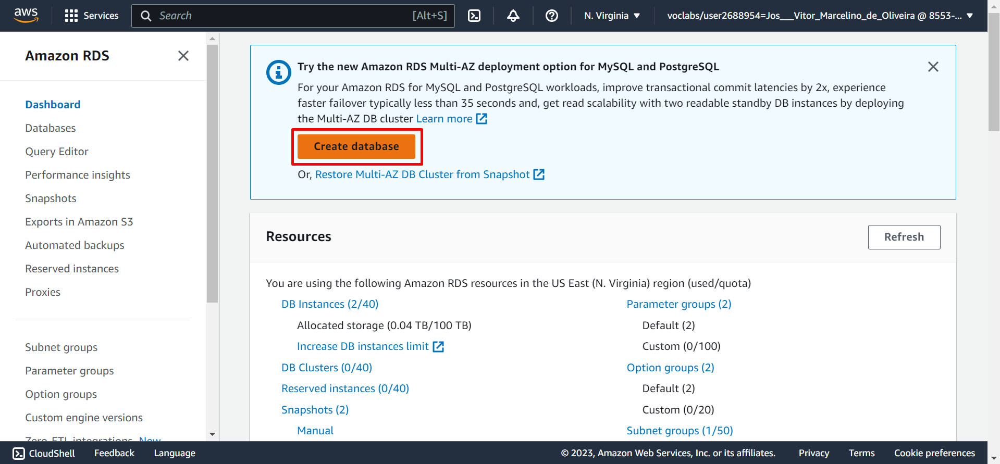
Figura 74: Criando banco de dados RDS
<br>
<br>

Em seguida, optamos pelo MySQL como nosso sistema de gerenciamento de banco de dados. A escolha por esse sistema se deve ao seu caráter relacional e à sua capacidade de atender às características fundamentais para sustentar nossos requisitos. Com o MySQL, conseguimos manter a disponibilidade de nossos dados, garantindo que toda solicitação feita ao nosso banco de dados receba uma resposta, indicando tanto o sucesso quanto eventuais falhas na execução. Além disso, o MySQL assegura a consistência dos acessos aos dados, mantendo-os sempre em um estado coerente, refletindo imediatamente quaisquer alterações realizadas. Essa abordagem contribui significativamente para a preservação da integridade e confiabilidade dos dados em nosso sistema.

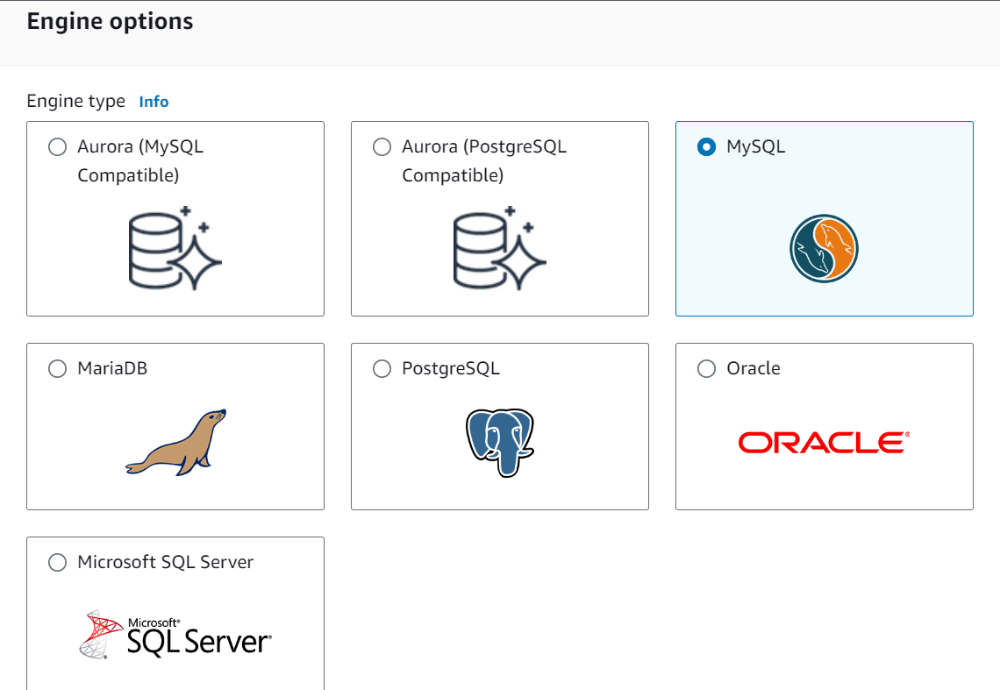
Figura 75: Escolhendo tipo de banco
<br>
<br>

Após a seleção do tipo de banco de dados, procedemos à criação das credenciais (usuário e senha) que serão empregadas para estabelecer a conexão com nosso sistema.

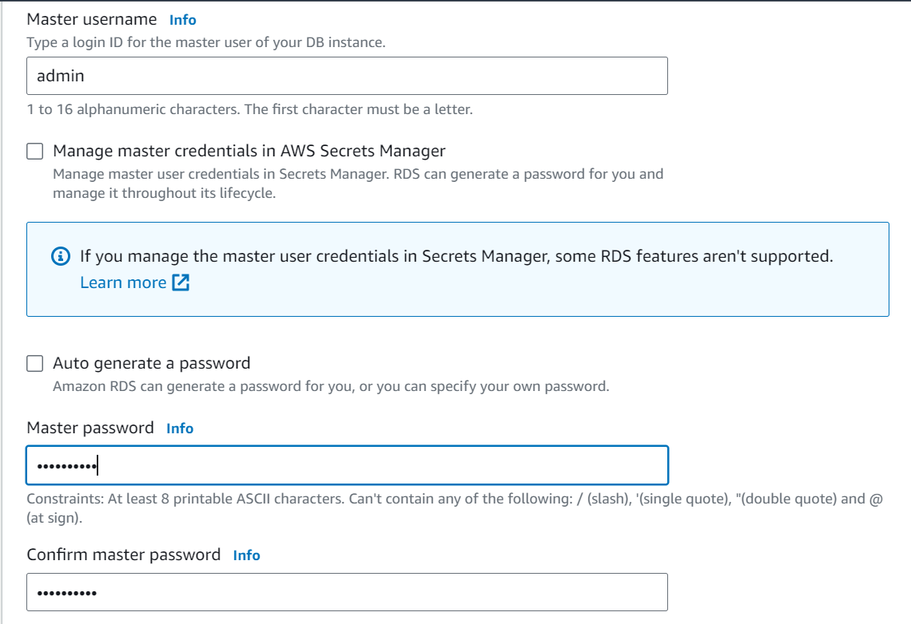
Figura 52: Setando credenciais para acesso do banco
<br>
<br>
Na etapa de configuração da conectividade, optamos por permitir que nosso banco de dados estabeleça conexões sem depender exclusivamente de uma instância EC2. Isso nos possibilita acessar o banco de dados localmente, eliminando a necessidade de que a conexão seja originada a partir de uma instância EC2.

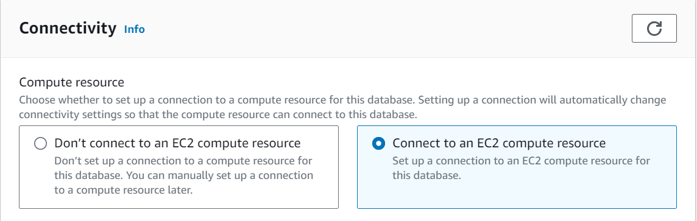
Figura 76: Selecionando o tipo de conexão do nosso banco de dados 
<br>
<br>
Após a criação e configuração bem-sucedidas do nosso banco de dados MySQL no Amazon RDS (Relational Database Service) da AWS, avançamos para a definição da estrutura pela qual nosso backend se comunicará com o banco de dados. Confira o passo a passo abaixo:
<br>
O código abaixo define uma classe chamada _MysqlConnection_ que implementa a interface _IMysqlConnection_. Essa classe é projetada para representar uma conexão com um banco de dados MySQL. O método construtor recebe um argumento chamado _mysqlConnectionConfig_, que é um objeto contendo as configurações necessárias para estabelecer a conexão com o banco de dados MySQL.

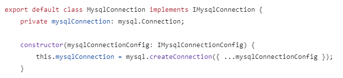
Figura 77: Classe de conexão MySQL
<br>
<br>

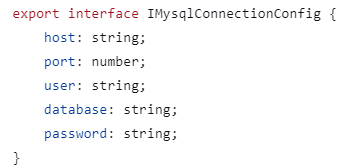
Figura 78: Interface da Classe de conexão MySQL
<br>
<br>

As configurações necessárias para estabelecer a conexão são obtidas a partir da classe de configuração do ambiente. As informações reais para conseguir acesso ao nosso banco de dados estão em um arquivo confidencial .ENV para evitar que informações confidenciais (Ex: Senha) fiquem expostas.

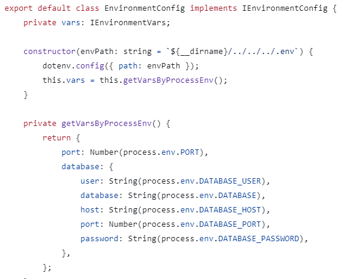
Figura 79: Configuração de ambiente
<br>
<br>


Figura 80: Trecho do arquivo .ENV do projeto referente ao banco de dados
<br>
<br>

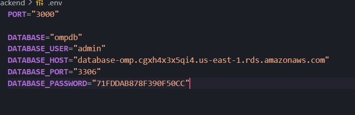
Figura 81: Trecho do arquivo .ENV do projeto referente ao banco de dados

<br>

A partir dos dados adquiridos do arquivo .ENV, setamos a conexão com o banco de dados a partir das variáveis retornadas da função _getVars()_.

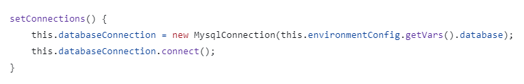
Figura 82: Fazendo Set da conexão com as variáveis adquiridas a partir do .ENV
<br>
<br>

**Com exceção de tabelas, não criamos nenhum objeto adicional, como por exemplo, views e outros.**

As tabelas desenvolvidas no banco de dados foram criadas seguindo um padrão de nomeclatura.

*omp_nome_da_tabela*

(omp se refere ao acrônimo do nome do projeto e o espaço entre as palavras do nome de uma tabela é separado por underline).

Até o momento, as tabelas criadas são:

**omp_class**

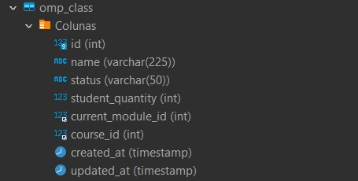

<br>
<br>

**omp_company**

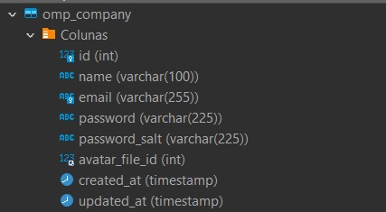

<br>
<br>

**omp_competence**

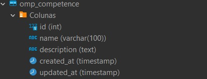

<br>
<br>

**omp_course**

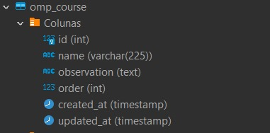

<br>
<br>

**omp_file**

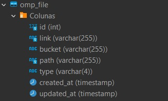

<br>
<br>

**omp_initiative**

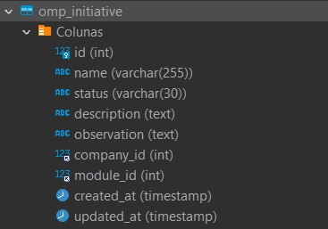

<br>
<br>

**omp_initiative_competence**

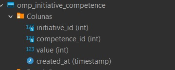

<br>
<br>

**omp_module**

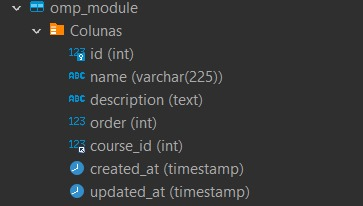

<br>
<br>


**omp_module_competence**

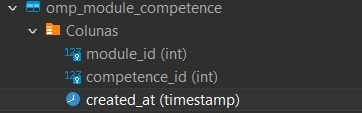

<br>
<br>

**omp_project**

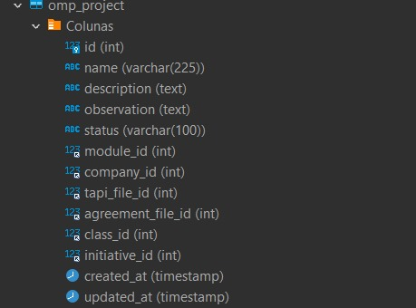

<br>
<br>

**omp_prototype**


<br>
<br>

**omp_project_competence**

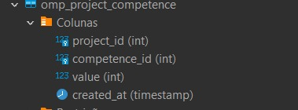

<br>
<br>

**omp_project_teacher**

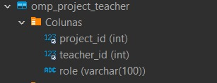

<br>
<br>

**omp_teacher**

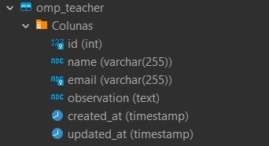

<br>
<br>


**omp_user**

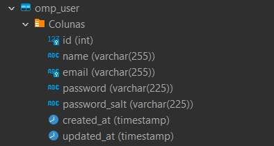

<br>


<br>

[Link para acessar a ordem de criação das tabelas](documentos/scripts_1.0/README.md)

(Caso não consiga acessar, o caminho para o arquivo é "documentos/scripts_1.0/README.md")

[Link para acessar a pasta de scripts de criação das tabelas](documentos/scripts_1.0/)

(Caso não consiga acessar, o caminho para o arquivo é "documentos/scripts_1.0/")

### 7.2.1 - Operações CRUD

Nossa aplicação possui 4 entidades já funcionando no sistema. São elas: Módulos, Projetos, Iniciativas e Protótipos. Dividimos o CRUD dessas entidades em camadas no nosso back-end para dividir as responsabilidades de cada algoritmo do sistema e também para tornar o código mais reutilizável.
Segue abaixo o procedimento feito para o CRUD das entidades. 


No trecho de código abaixo, definimos alguns comandos SQL em funções genéricas para tornar esses códigos replicáveis e posteriormente poder aplicar em cada método para cada entidade.

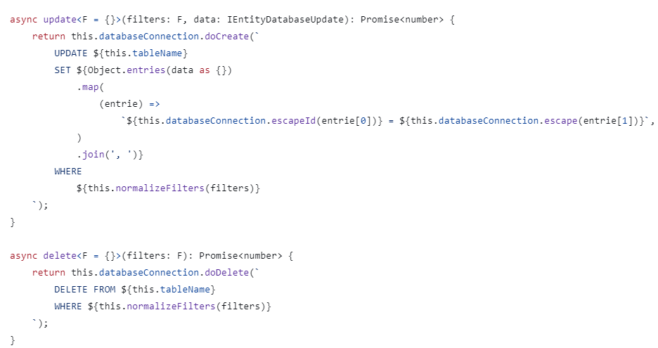
Figura 59: Código do SQL genérico

<br>

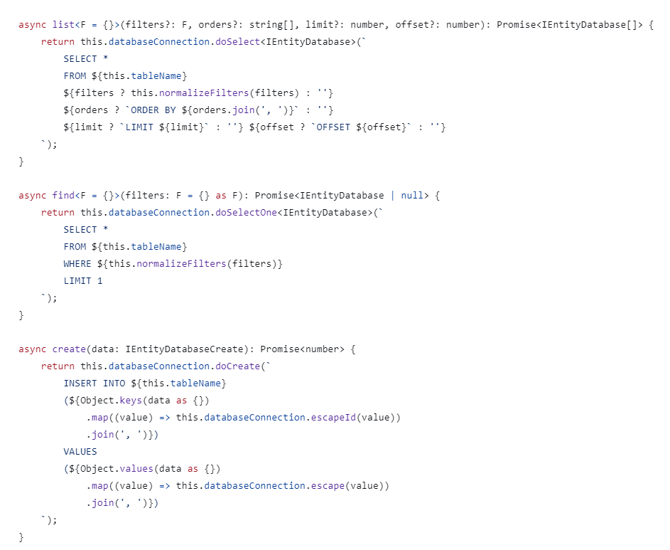
Figura 60: Código do SQL genérico (2) 

---
<br>

Nessa parte do código definimos uma classe abstrata chamada Service que serve como uma camada intermediária entre controladores e repositórios em uma aplicação. A classe Service fornece métodos genéricos para criar, atualizar, buscar, listar e excluir entidades de um banco de dados. Esses métodos são criados com base nas funções criadas no print da imagem 59 e 60.

_createAndFind_: Cria uma nova entidade e a busca pelo ID recém-criado.

_updateByIdAndFind_: Atualiza uma entidade existente por ID e a busca novamente.

_findById_: Busca uma entidade por ID.

_updateById_: Atualiza uma entidade existente por ID.

_deleteById_: Exclui uma entidade por ID.

_list_: Lista entidades com opções de filtro, ordenação, limite e deslocamento.


Generalizamos esse métodos para que fossem compatíveis com todas nossas entidades e fosse reutilizável.

Segue abaixo prints de cada entidade.

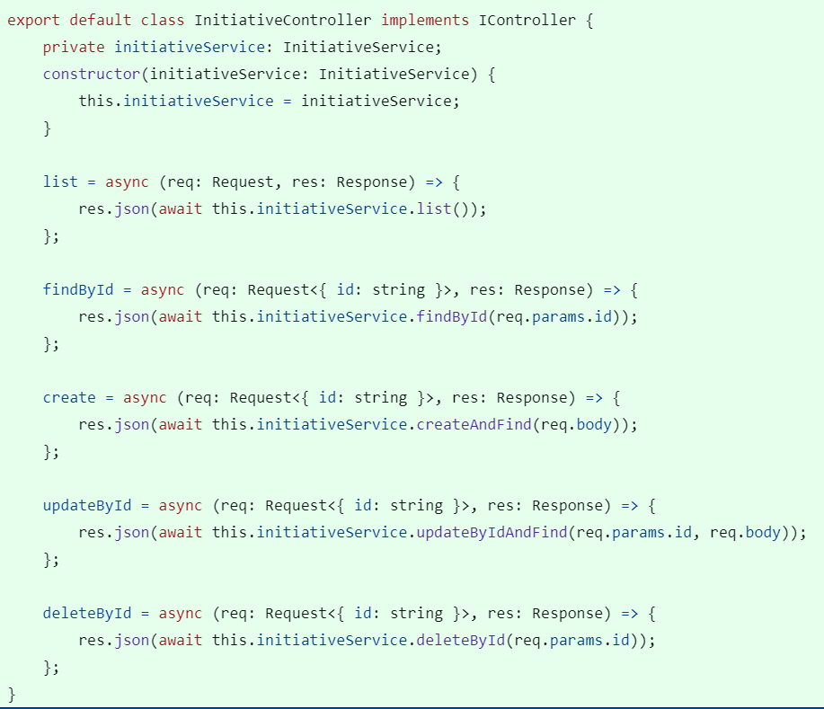
Figura 61: Código dos métodos da entidade Iniciativa.

<br>
<br>

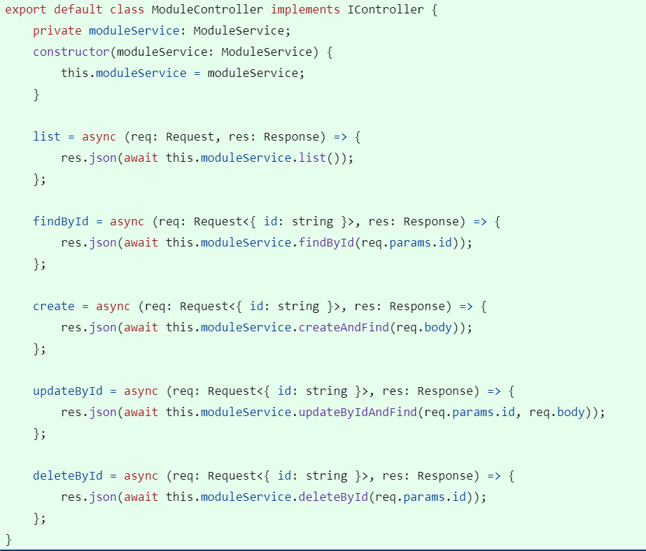
Figura 62: Código dos métodos da entidade Módulo.

<br>
<br>

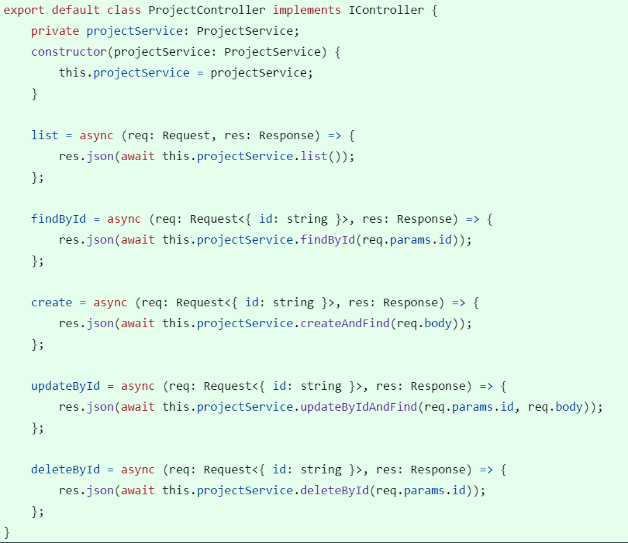
Figura 63: Código dos métodos da entidade Projeto.

<br>
<br>

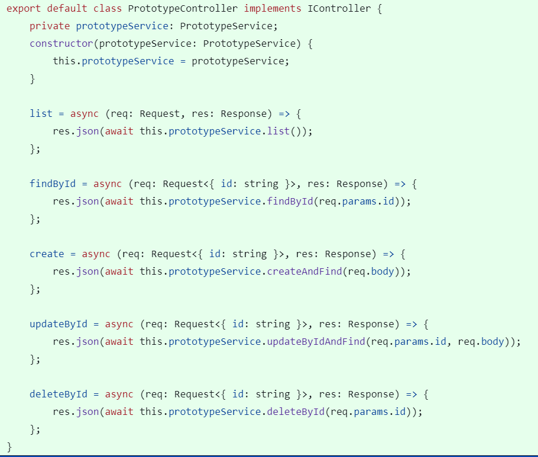
Figura 64: Código dos métodos da entidade Protótipo.

---
<br>

Olhando para o CRUD, nosso foco principal será a função
Método setRoutes():

Este método é responsável por configurar as rotas para as diferentes operações relacionadas às nossas entidades (listagem, criação, busca por ID, atualização e exclusão).

A seguir, apresentamos a estruturação do nosso código, assegurando sua excelência:

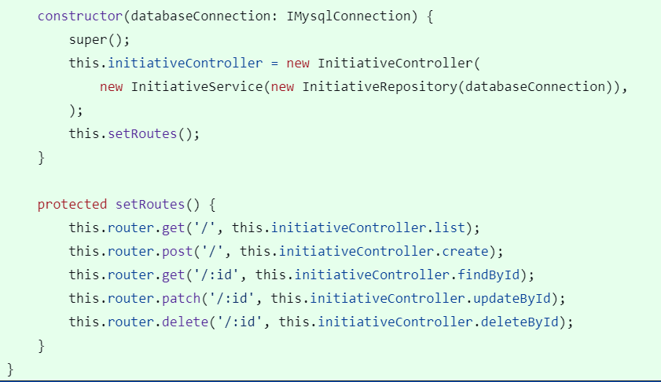
Figura 65: Router da iniciativa.

<br>

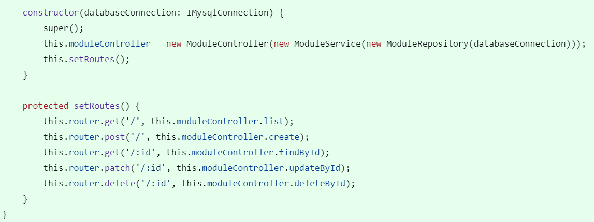
Figura 66: Router do módulo.

<br>

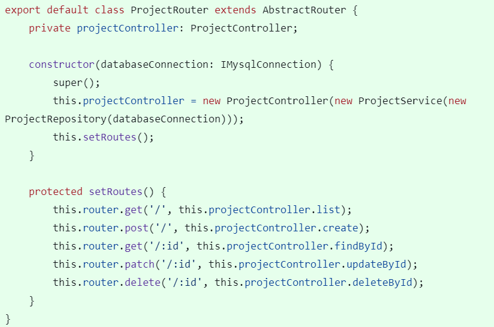
Figura 67: Router do projeto.

<br>

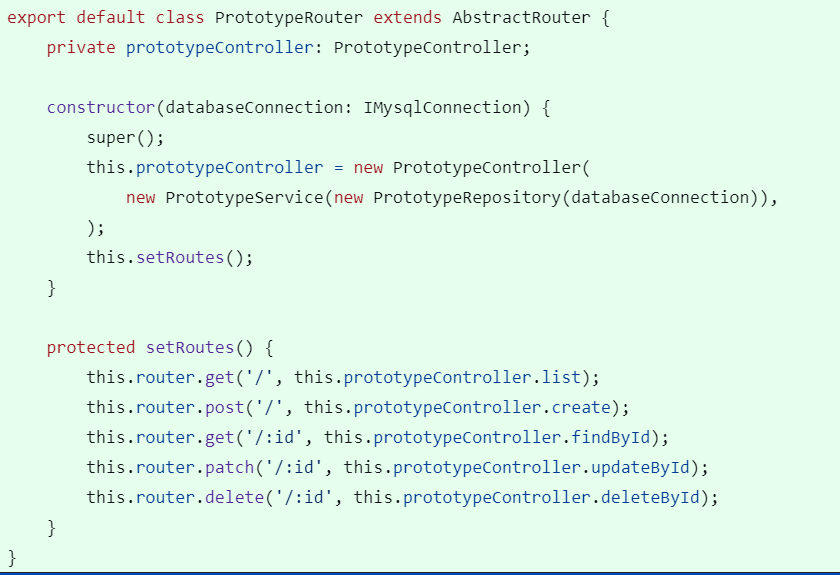
Figura 68: Router do protótipo.

---
<br>

Aqui está o padrão que seguimos em TypeScript para a criação de interfaces. Essas interfaces representam as estruturas esperadas dos objetos relacionados às nossas entidades que são armazenadas ou manipuladas em um banco de dados na aplicação. Essas interfaces são fundamentais para definir o formato dos dados que podem ser criados, atualizados ou recuperados no contexto do banco de dados.

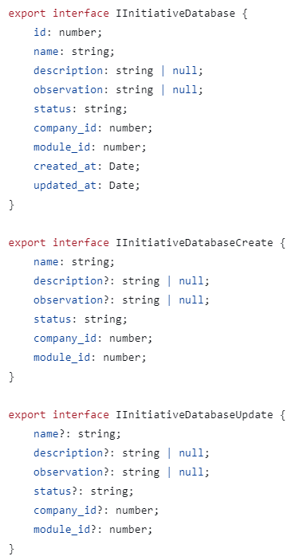
Figura 69: Interface da iniciativa.
<br>
<br>
<br>

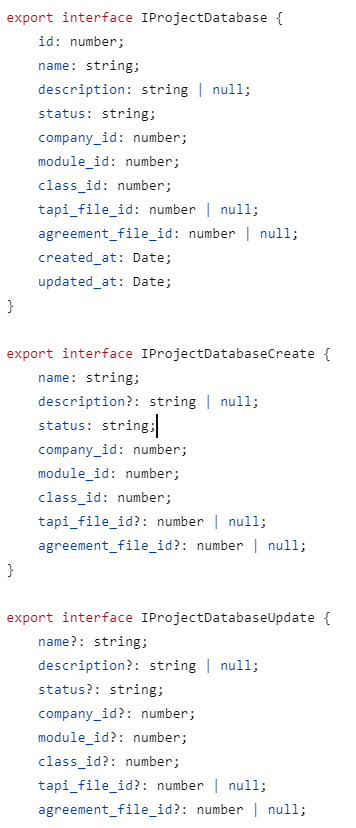
Figura 70: Interface do projeto.
<br>
<br>
<br>

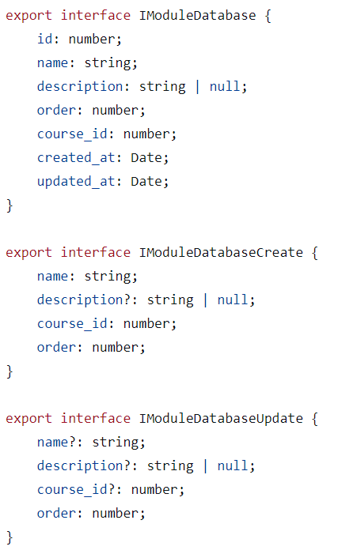
Figura 71: Interface do módulo.
<br>
<br>
<br>

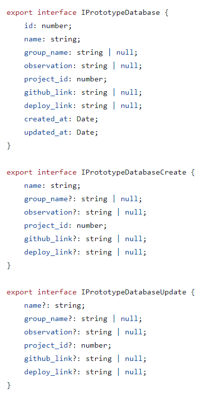
Figura 72: Interface do protótipo.
<br>
<br>
<br>

Com o código a seguir, pretendemos utilizar os métodos genéricos criados anteriormente para realizar requisições no banco de dados, levando em consideração suas funcionalidades.

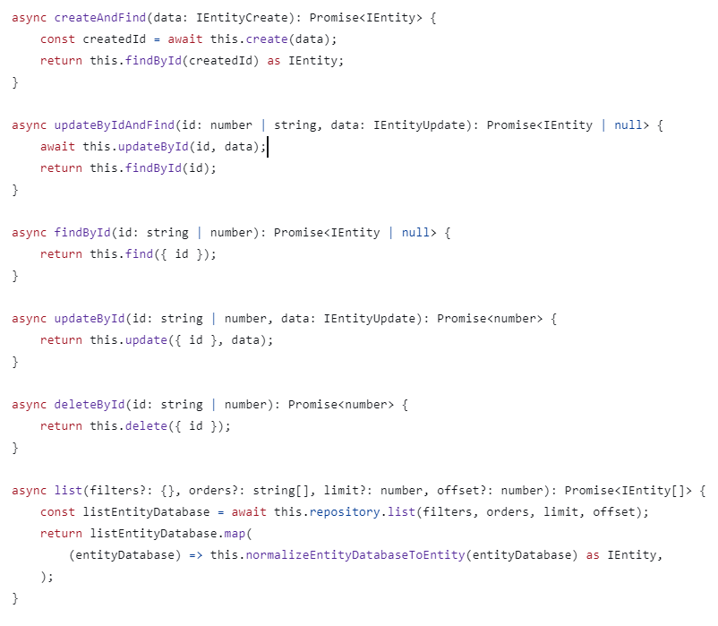
Figura 73: Métodos de requisição (1).

<br>

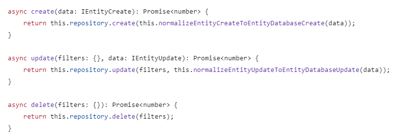
Figura 74: Métodos de requisição (2).

<br>
<br>

# 8.	Documentação da API

Na arquitetura do nosso backend, empregamos uma seleção de tecnologias essenciais como o Visual Studio Code, um editor de código fonte da Microsoft, onde concebemos toda a infraestrutura do nosso backend, fazendo uso da combinação do Node.js e TypeScript. A escolha pelo Node.js se justifica pela sua incorporação do framework Express.js. Esse framework não apenas otimiza a eficiência e produtividade do desenvolvimento, mas também amplia a escalabilidade da nossa plataforma, graças às suas bibliotecas. Express.js oferece suporte nativo à integração com o banco de dados PostgreSQL. Ademais, esta é uma ferramenta que já se provou valiosa em projetos anteriores.

Para elevar ainda mais a qualidade do nosso backend, optamos pela linguagem TypeScript, uma extensão do JavaScript. Essa escolha permite a implementação de tipagem estática, conferindo um ganho substancial à segurança, legibilidade e escalabilidade do código. Em suma, quando especificamos os tipos de dados das variáveis, os parâmetros requeridos por funções, entre outras estruturas, o compilador TypeScript avalia e verifica essas informações durante a compilação. Esse procedimento nos auxilia a identificar e solucionar erros antes mesmo da execução do código.

Conforme dito no texto sobre frontend também utilizamos a tecnologia Docker, uma plataforma de código aberto criado por Solomon Hykes que permite usuários desenvolverem tecnologias em contêineres isolados. Contêineres são, de forma simplista, algo como uma máquina virtual, onde é possível isolar uma aplicação e trocar dados entre o sistema em que está e o sistema operacional base de forma fácil e eficiente. Uma das grandes vantagens de se utilizar o Docker são as imagens, elas permitem criar um ambiente pré-configurado com alguma tecnologia de forma extremamente rápida. Por conta de seus benefícios, o Docker foi usado nesse projeto para a criação dos contêineres de backend e frontend, tanto em desenvolvimento quanto em produção.

Ao finalizarmos a etapa de codificação do backend, optamos por submetê-lo a testes e documentação por meio da plataforma Postman. Esta plataforma apresenta uma interface de fácil compreensão e uso intuitivo. Tais características simplificam a criação de solicitações HTTP, essenciais para interagir com a nossa API. Utilizando o Postman, monitoramos de maneira eficaz as requisições e respostas, permitindo um acompanhamento detalhado. Além disso, essa plataforma já se mostrou eficiente em projetos anteriores.

Para documentar a API, utilizamos Swagger, framework composto por diversas ferramentas que auxilia a descrição, consumo e visualização de serviços de uma API. Documentamos a API para que um usuário possa consumí-la facilmente, ao mesmo tempo em que conseguimos manter controle sobre o que está sendo desenvolvido. O link da documentação da API pode ser encontrado [aqui](https://app.swaggerhub.com/apis-docs/ISRAELCARVALHO/api-omp/1.0.0), e sua referência local está em [src/backend/src/swagger.json](src/backend/src/swagger.json). Vale ressaltar que, uma vez que a API está em funcionamento, a documentação também pode ser acessada na rota "/api-docs".

Com todos esses passos realizados, partimos para o deploy do nosso backend na nuvem utilizando uma instância EC2 t2.micro com 8GB de armazenamento configurada a partir de uma imagem de Amazon Linux. O deploy foi feito com o auxílio do Docker, direcionando os acessos da porta 80 e 443 para a porta 3000 onde a API em node.js está escutando. Para garantir que o IP público não mude, foi criado um IP elástico de endereço 34.234.150.40.
 
# Referências

Toda referência citada no texto deverá constar nessa seção, utilizando o padrão de normalização da ABNT - ABNT NBR 10520. As citações devem ser confiáveis e relevantes para o trabalho. São imprescindíveis as citações dos sites de download das ferramentas utilizadas, bem como a citação de algum objeto, música, textura ou outros que não tenham sido produzidos pelo grupo, mas utilizados (mesmo no caso de licenças gratuitas, royalty free ou similares)
Sugerimos o uso do sistema autor-data para citações.

# Apêndice 
Os apêndices representam informações adicionais que não caberiam no documento exposto acima, mas que são importantes por alguma razão específica do projeto. 

## 📝 Descrição

Curta descrição sobre o que o seu projeto faz (problema a ser resolvido e solução proposta - máx. 250 palavras - deve conter link para vídeo de demonstração - pode conter imagens).

## Documentação

Os arquivos da documentação deste projeto estão na pasta [documentos/index.md](documentos/index.md), e o seu conteúdo é publicado via GitHub Pages.


## 📝 LINKS

Clique <a href="https://www.linkedin.com/in/victorbarq/">AQUI</a> para acessar a plataforma de consolidação dos dados.

<a href="https://www.linkedin.com/in/victorbarq/">Link para o Manual de Instruções</a> que explica como montar, conectar e utilizar o protótipo.

<a href="https://www.linkedin.com/in/victorbarq/">Link para a documentação geral</a> do projeto.

## 📁 Estrutura de pastas

```
Alunos inteli (remover essa observação do readme.md após leitura e execução):

Supondo que você é da Turma 4 e Projeto 5, substitua:

T(NUMERO_DA_TURMA)_G(NUMERO_DO_GRUPO)_V(VERSÃO)_document.pdf
por
T6_G1_V01_document.pdf

Faça o mesmo para a documentação em formato DOCX, se houver.
```

|--> documentos<br>
  &emsp;| --> outros <br>
  &emsp;| T(NUMERO_DA_TURMA)_G(NUMERO_DO_GRUPO)_V(VERSÃO)_document.pdf<br>
  &emsp;| T(NUMERO_DA_TURMA)_G(NUMERO_DO_GRUPO)_V(VERSÃO)_document.docx<br>
|--> imagens<br>
|--> src<br>
  &emsp;|--> Circuito<br>
| readme.md<br>
| license.txt

Dentre os arquivos presentes na raiz do projeto, definem-se:

- <b>readme.md</b>: arquivo que serve como guia e explicação geral sobre o projeto (o mesmo que você está lendo agora).

- <b>documentos</b>: aqui estarão todos os documentos do projeto. Há também uma pasta denominada <b>outros</b> onde podem estar presentes documentos complementares à documentação principal.

- <b>imagens</b>: imagens relacionadas ao projeto como um todo (por exemplo imagens do sistema, do grupo, logotipos e afins).

- <b>src</b>: nesta pasta encontra-se todo o código fonte do sistema (circuito e eventuais sistemas complementares).

## 💻 Configuração para desenvolvimento

```
Alunos inteli (remover essa observação do readme.md após leitura e execução):

Oriente o usuário a configurar passo-a-passo o Ubidots, para que ele reproduza a experiência completa com o protótipo coletando dados. Vocês podem optar por colocar instruções no próprio Manual de Instruções, e neste caso, pode remover esta seção completamente.
```

Aqui encontram-se todas as instruções necessárias para a configuração do sistema

1. passo 1
2. passo 2
3. passo 3

## 🗃 Histórico de lançamentos

* 0.2.1 - 25/01/2022
    * Atualização de documentos (código do módulo permanece inalterado).
* 0.2.0 - 15/01/2022
    * Remove `setDefaultXYZ()`
    * Adiciona `init()`
* 0.1.1 - 11/01/2022
    * Crash quando chama `baz()`
* 0.1.0 - 10/01/2022
    * O primeiro lançamento adequado
    * Renomeia `foo()` para `bar()`
* 0.0.1 - 01/01/2022
    * Trabalho em andamento

## 📋 Licença/License
```
Alunos inteli (remover essa observação do readme.md após leitura e execução, junto com o link para o tutorial):

1. Siga o tutorial para criação da licença: 
```
<a href="https://drive.google.com/file/d/1hXWLHUhjBkPVuGqeE2LZKozFntnJZzlx/view">Tutorial</a>

<p xmlns:cc="http://creativecommons.org/ns#" xmlns:dct="http://purl.org/dc/terms/"><a property="dct:title" rel="cc:attributionURL" href="https://github.com/Intelihub/Template_M4/">MODELO GIT INTELI</a> by <a rel="cc:attributionURL dct:creator" property="cc:attributionName" href="https://www.yggbrasil.com.br/vr">Inteli, Nome do integrante 1, Nome do integrante 2, Nome do integrante 3, Nome do integrante 4, Nome do integrante 5, Nome do integrante 6, Nome do integrante 7</a> is licensed under <a href="http://creativecommons.org/licenses/by/4.0/?ref=chooser-v1" target="_blank" rel="license noopener noreferrer" style="display:inline-block;">Attribution 4.0 International</a>.</p>
